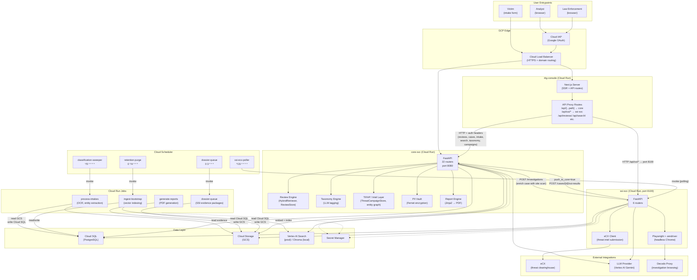

# I4G Platform — System Narrative

**Last Verified:** March 2026  
**Audience:** New engineers, executives, technical stakeholders  
**Tier:** 0 — System-level single source of truth  
**Update policy:** Update when scope or component inventory changes. Read in under 20 minutes.

---

## Section 1 — Mission and Scope

**Intelligence for Good (i4g)** is an AI-powered investigative platform that helps volunteer analysts and law enforcement officers identify, document, and build cases against cryptocurrency and romance scam operations — particularly those targeting senior citizens.

**What the platform does:**

- Receives victim reports via a structured intake form (web)
- Ingests, OCR-processes, and semantically indexes uploaded evidence (chat logs, screenshots, transaction records)
- Enables analysts to search, review, classify, and annotate cases using AI-assisted retrieval
- Automatically investigates scam websites using browser automation, capturing evidence dossiers for law enforcement
- Classifies fraud patterns using a versioned taxonomy powered by an LLM tagging pipeline
- Detects coordinated campaigns and entity relationships through threat intelligence analytics (TIFAP)
- Generates structured law enforcement reports from reviewed cases
- Submits threat intelligence packages to external clearinghouses (eCX integration)
- Protects victim privacy through field-level encryption and audit-logged decryption

**What the platform does not do:**

- Direct victim outreach or case management (victims submit reports; platform supports analysts)
- Real-time transaction monitoring or banking integrations
- Public prosecutor or court case management
- Domain takedown or active threat disruption (evidence collection and reporting only)

**Who uses it:**

- **Volunteer analysts** — primary users. Review, classify, and approve cases in the analyst console.
- **Law enforcement officers (LEO)** — read-only access to approved, redacted case packages.
- **Internal admins** — manage ingestion, feature flags, and operational health.

---

## Section 2 — Component Inventory

All components are deployed on Google Cloud Platform. Versions are at v0.1.0 (active pre-1.0 development).

| Component                   | Type                          | Owning Repo        | Primary Framework                         | Docker Image                 | Purpose                                                                                                                                   |
| --------------------------- | ----------------------------- | ------------------ | ----------------------------------------- | ---------------------------- | ----------------------------------------------------------------------------------------------------------------------------------------- |
| `core-svc`                  | Cloud Run service             | `core/`            | FastAPI (Python 3.11+)                    | `core-svc:dev/prod`          | Primary REST API — cases, reviews, intake, reports, taxonomy, campaigns, intelligence, SSI proxy endpoints. The authoritative data plane. |
| `i4g-console`               | Cloud Run service             | `ui/`              | Next.js 15 (React 19)                     | `i4g-console:dev/prod`       | Analyst console. Server-side Next.js with proxy routes forwarding analyst requests to `core-svc`.                                         |
| `ssi-svc`                   | Cloud Run service             | `ssi/`             | FastAPI (Python 3.11+)                    | `ssi-svc:dev/prod`           | Scam Site Investigator. Autonomous browser-based investigation of scam URLs using Playwright + zendriver. Port 8100.                      |
| `ingest-bootstrap`          | Cloud Run job                 | `core/`            | Python CLI (`i4g jobs ingest`)            | `ingest-job:dev/prod`        | Ingests new intake records into the vector store and relational DB. Triggered by Cloud Scheduler.                                         |
| `process-intakes`           | Cloud Run job                 | `core/`            | Python CLI (`i4g jobs intake`)            | `intake-job:dev/prod`        | OCR-processes uploaded documents, extracts entities, and stages records for ingestion.                                                    |
| `generate-reports`          | Cloud Run job                 | `core/`            | Python CLI (`i4g jobs report`)            | `report-job:dev/prod`        | Generates formatted PDF law enforcement reports from reviewed cases.                                                                      |
| `dossier-queue`             | Cloud Run job                 | `core/`            | Python CLI (`i4g jobs dossier`)           | `dossier-job:dev/prod`       | Generates investigation dossiers (SSI evidence packages) for cases flagged for investigation.                                             |
| `classification-sweeper`    | Cloud Scheduler → ingest-job  | `infra/`           | Cloud Scheduler                           | (invokes `ingest-bootstrap`) | Triggers intake processing every 5 minutes.                                                                                               |
| `dossier-queue` (scheduler) | Cloud Scheduler → dossier-job | `infra/`           | Cloud Scheduler                           | (invokes `dossier-queue`)    | Triggers dossier generation daily at 03:00 UTC.                                                                                           |
| `retention-purge`           | Cloud Scheduler → ingest-job  | `infra/`           | Cloud Scheduler                           | (invokes ingest image)       | Purges records beyond retention window. Every 4 hours.                                                                                    |
| `analytics-refresh`         | Cloud Scheduler               | `infra/`           | Cloud Scheduler                           | —                            | Refreshes analytics aggregates.                                                                                                           |
| `ssi-ecx-poller`            | Cloud Scheduler → ssi-svc     | `infra/`           | Cloud Scheduler                           | (invokes SSI or ssi image)   | Polls eCX for threat intel submission responses every 15 minutes.                                                                         |
| Cloud SQL (PostgreSQL)      | Managed database              | `infra/`           | Google Cloud SQL                          | —                            | Authoritative relational store for cases, reviews, intakes, entities, campaigns, audit logs.                                              |
| Cloud Storage (GCS)         | Object storage                | `infra/`           | Google Cloud Storage                      | —                            | Evidence files, OCR outputs, generated reports, dossier archives.                                                                         |
| Vertex AI / Chroma          | Vector store                  | `infra/` (`core/`) | Vertex AI Search (cloud) / Chroma (local) | —                            | Semantic embeddings for hybrid case search.                                                                                               |
| Secret Manager              | Secrets                       | `infra/`           | Google Secret Manager                     | —                            | All service credentials, API keys, encryption keys.                                                                                       |
| Cloud Scheduler             | Job orchestration             | `infra/`           | Google Cloud Scheduler                    | —                            | Triggers all periodic Cloud Run jobs.                                                                                                     |

> ⚠️ **Verification needed** — The `analytics-refresh` scheduler target (which image/job it invokes) and the exact `retention-purge` trigger were inferred from Terraform variable names. Confirm in `infra/environments/app/dev/terraform.tfvars` `scheduled_run_jobs` block before relying on this table.

---

## Section 3 — System Integration Map



**Key integration notes:**

- **UI → Core**: The Next.js console uses server-side API route handlers (`/api/[...path]`) as a proxy layer. All analyst requests flow through this proxy, which threads auth headers and enforces same-origin constraints. The proxy does not transform payloads.
- **UI → SSI**: SSI endpoints are proxied via `/api/ssi/*` routes (distinct from the core catch-all). Whether this is direct to `ssi-svc` or through `core-svc` should be verified in `ui/apps/web/src/app/api/ssi/`.
- **Core → SSI enrichment**: `core-svc` calls `ssi-svc` to trigger site investigations for flagged cases. SSI stores results locally and pushes them back to core via `push_to_core=true` (configured in `ssi/config/settings.default.toml`).
- **TIFAP**: The Threat Intelligence and Fraud Analytics Pipeline runs as part of `core-svc` (not a separate service). It uses internal stores (`ThreatCampaignStore`, `WatchlistStore`, `AnnotationStore`) backed by Cloud SQL.
- **Cloud Scheduler → Jobs**: All jobs are invoked via HTTP POST to the Cloud Run Jobs API using OIDC tokens. Deduce the job-to-scheduler mapping from `infra/environments/app/dev/terraform.tfvars`.

> ⚠️ **Verification needed** — Confirm whether the UI's `/api/ssi/*` routes proxy directly to `ssi-svc` on port 8100 or whether they go through `core-svc`'s `ssi_*` routers. Check `ui/apps/web/src/app/api/ssi/route.ts`.

---

## Section 4 — Data Ownership

| Data Domain                                                       | Authoritative Store                       | Authoritative Writer                                           | Readers                                                                                                                                                     |
| ----------------------------------------------------------------- | ----------------------------------------- | -------------------------------------------------------------- | ----------------------------------------------------------------------------------------------------------------------------------------------------------- |
| **Case records** (`cases` table)                                  | Cloud SQL                                 | `core-svc` ingestion pipeline                                  | `core-svc` API, analyst console via proxy                                                                                                                   |
| **Review/queue records** (`review_queue`, `review_actions`)       | Cloud SQL                                 | `core-svc` review API                                          | `core-svc` API                                                                                                                                              |
| **Victim intake records** (`intake_records`)                      | Cloud SQL                                 | `process-intakes` job                                          | `core-svc` API (contact fields decrypted by authorized operators only)                                                                                      |
| **PII fields** (contact: name, email, phone, handle in `intakes`) | Cloud SQL (Fernet-encrypted)              | `process-intakes` job (encrypts at write time)                 | `GET /intakes/{id}/contact` — dual-approved, audit-logged. See [`core/docs/policies/detokenization_sop.md`](../../core/docs/policies/detokenization_sop.md) |
| **Entities** (`entities` table)                                   | Cloud SQL                                 | `process-intakes` job                                          | `core-svc` API                                                                                                                                              |
| **Vector embeddings**                                             | Vertex AI Search (cloud) / Chroma (local) | `ingest-bootstrap` job                                         | `core-svc` `HybridRetriever`                                                                                                                                |
| **Evidence files** (images, PDFs, chat logs)                      | GCS (`evidence/` bucket)                  | Victim intake submission → stored by intake pipeline           | `process-intakes` job, report generation, dossier generation                                                                                                |
| **OCR outputs**                                                   | GCS                                       | `process-intakes` job                                          | Ingestion pipeline                                                                                                                                          |
| **Generated reports** (PDFs)                                      | GCS (`reports/` bucket)                   | `generate-reports` job                                         | `core-svc` export API, analyst console                                                                                                                      |
| **SSI investigation results** (`site_scans` table)                | Cloud SQL (SSI schema)                    | `ssi-svc` investigation engine                                 | `ssi-svc` API, `core-svc` SSI proxy routers                                                                                                                 |
| **SSI evidence archives** (screenshots, HAR, dossiers)            | GCS                                       | `ssi-svc` browser capture                                      | Dossier job, analyst console                                                                                                                                |
| **Fraud taxonomy definitions**                                    | Cloud SQL (taxonomy tables)               | Taxonomy versioning pipeline (LLM batch job)                   | `core-svc` taxonomy API                                                                                                                                     |
| **Campaign records** (`campaigns` table)                          | Cloud SQL                                 | `core-svc` campaign API (TIFAP writes threat-linked campaigns) | `core-svc` API                                                                                                                                              |
| **Threat/intel annotations**                                      | Cloud SQL                                 | `core-svc` intelligence layer (TIFAP)                          | `core-svc` intelligence API, analyst console                                                                                                                |
| **Audit log** (`audit_log` table)                                 | Cloud SQL                                 | `core-svc` (every contact decryption, review action)           | Security/compliance review only                                                                                                                             |
| **Secrets / encryption keys**                                     | Google Secret Manager                     | Platform Terraform                                             | `core-svc`, `ssi-svc`, Cloud Run jobs (via OIDC)                                                                                                            |

---

## Section 5 — Authentication and Identity Topology

### User Authentication

```
Analyst/LEO browser
  → Cloud Load Balancer
  → Cloud IAP (Google OAuth 2.0)
      ├─ Validates Google identity
      ├─ Issues IAP-signed JWT in X-Goog-IAP-JWT-Assertion header
      └─ Forwards to Next.js (i4g-console)

i4g-console (Next.js)
  → Reads IAP JWT from request headers
  → Threads identity token through to core-svc via server-side API proxy
  → core-svc validates token (OIDC verify in cloud; mock identity in local/dev)
```

- **IAP-protected paths**: The analyst console (`i4g-console`) is the primary IAP-gated entry point.
- **Direct API access**: `core-svc` endpoints may be accessible directly under IAP for service clients (e.g., Cloud Run jobs with service accounts).
- **Auth can be disabled**: `settings.identity.disable_auth = true` is available in `settings.default.toml` for local development only. Never set in cloud environments.

### Service-to-Service Authentication

| Service                               | Auth Method                                 | Notes                                                           |
| ------------------------------------- | ------------------------------------------- | --------------------------------------------------------------- |
| `core-svc` → external                 | OIDC (Workload Identity Federation)         | No long-lived credentials; impersonates service account via WIF |
| `ssi-svc` → `core-svc` (push results) | Configured in `ssi.integration` settings    | Uses service account token                                      |
| Cloud Scheduler → Cloud Run jobs      | OIDC token (scheduler SA → invoker role)    | `roles/run.invoker` granted per job                             |
| Cloud Run jobs → Cloud SQL            | IAM auth (service account email as DB user) | e.g., `sa-ingest@i4g-dev.iam`                                   |
| Cloud Run jobs → GCS                  | IAM (service account)                       | Bucket-scoped permissions                                       |
| Cloud Run jobs → Secret Manager       | IAM                                         | Accessed via `google-cloud-secret-manager` SDK                  |

### Local / Dev Identity

| Environment | Identity Mode                                                                                    |
| ----------- | ------------------------------------------------------------------------------------------------ |
| `local`     | `mock` identity — no real OAuth; any request is treated as authenticated with a seeded test user |
| `i4g-dev`   | Real OIDC via IAP; service accounts via WIF                                                      |
| `i4g-prod`  | Same as dev; stricter IAM bindings                                                               |

---

## Section 6 — Deployment Environments

| Dimension                      | `local`                        | `i4g-dev`                                               | `i4g-prod`                         |
| ------------------------------ | ------------------------------ | ------------------------------------------------------- | ---------------------------------- |
| **Identity provider**          | Mock (no OAuth)                | Google IAP + OAuth                                      | Google IAP + OAuth                 |
| **Database**                   | SQLite (local file)            | Cloud SQL (PostgreSQL) `i4g-dev:us-central1:i4g-dev-db` | Cloud SQL (PostgreSQL)             |
| **Vector store**               | Chroma (local directory)       | Vertex AI Search                                        | Vertex AI Search                   |
| **LLM provider**               | `mock` (deterministic stubs)   | `vertex_ai` / Gemini                                    | `vertex_ai` / Gemini               |
| **Storage (evidence/reports)** | Local filesystem (`data/`)     | GCS (`i4g-reports-dev` bucket etc.)                     | GCS                                |
| **Secrets**                    | `.env.local` file              | Google Secret Manager                                   | Google Secret Manager              |
| **Service deployment**         | `uvicorn` direct               | Cloud Run v2                                            | Cloud Run v2                       |
| **Jobs**                       | `i4g jobs <cmd>` CLI           | Cloud Run jobs via Cloud Scheduler                      | Cloud Run jobs via Cloud Scheduler |
| **Observability**              | Stdout logs                    | Cloud Logging + Cloud Monitoring                        | Cloud Logging + Cloud Monitoring   |
| **Auth**                       | Disabled (`disable_auth=true`) | OIDC enforced                                           | OIDC enforced                      |
| **SSI proxy**                  | `ssi-svc` on `localhost:8100`  | `ssi-svc` Cloud Run URL                                 | `ssi-svc` Cloud Run URL            |

**Key setting rule**: All environment-specific values flow through `I4G_*` env vars (double-underscore nesting maps to TOML section depth, e.g., `I4G_STORAGE__VECTOR_BACKEND=chroma`). Never hard-code environment values. See [`core/docs/config/`](../../core/docs/config/) for the full manifest.

---

## Section 7 — Repository Map

| Repo        | Owns                                                                                                                                                                                                   | Does Not Own                                                                        |
| ----------- | ------------------------------------------------------------------------------------------------------------------------------------------------------------------------------------------------------ | ----------------------------------------------------------------------------------- |
| `core/`     | FastAPI REST API, background job CLIs, ingestion pipeline, review engine, TIFAP analytics, fraud taxonomy, PII vault, report generation. The authoritative data plane for all case/review/intake data. | Browser automation, UI rendering, Terraform infra, product decisions                |
| `ui/`       | Next.js analyst console, API proxy layer, all frontend components and design system consumption.                                                                                                       | Backend logic (zero business logic in the proxy; transforms happen in core)         |
| `ssi/`      | Scam site investigation engine (Playwright, zendriver, Gemini), eCX submission client, SSI-specific data schema (`site_scans`, playbooks, evidence archives).                                          | Core case review logic, shared fraud taxonomy (reads from core; does not define it) |
| `infra/`    | Terraform modules and environment stacks for all GCP resources: Cloud Run services/jobs, Cloud SQL, GCS, IAP, IAM, Load Balancer, Cloud Scheduler, Secret Manager.                                     | Application code, product decisions                                                 |
| `planning/` | Product roadmap, PRDs, sprint plans, architecture decisions (ADRs, system narrative, integration contracts), change log. Cross-repo, environment-neutral ground truth.                                 | Application code, Terraform config                                                  |
| `docs/`     | GitBook end-user documentation (analyst guides, admin guides, LEO guides, API integration reference). Audience: operators and partners, not developers.                                                | Developer docs, infra runbooks, architectural internals                             |
| `copilot/`  | AI assistant intelligence: Copilot instructions, coding standards, workflow prompts, skills. What Copilot knows about this platform.                                                                   | Application code                                                                    |
| `mobile/`   | Design token source of truth — colors, spacing, typography for iOS, Android, and web. Token build scripts and platform wrappers.                                                                       | Mobile app code (tokens only; apps not yet built)                                   |

---

## Section 8 — Version and Release Policy

### Versioning

All three application repos (`core/`, `ui/`, `ssi/`) maintain independent `VERSION.txt` files. All are currently at `v0.1.0`, reflecting pre-1.0 active development status. There is no enforced lock-step versioning across repos; each service can be deployed independently after verifying integration contracts.

### Release Record

**Canonical release record:** [`planning/change_log.md`](../../planning/change_log.md)

All significant changes across all repos are logged here with date headers and bullet-point summaries. This is the highest-fidelity account of "what changed and when." When a deployment is made, the engineer adds an entry to `planning/change_log.md`.

### Build and Deploy

Docker images are built per service using `scripts/build_image.sh [service-name] [dev|prod]` and pushed to Artifact Registry (`us-central1-docker.pkg.dev/{project}/applications/{image}:{tag}`). Terraform manages the Cloud Run service and job configurations; updating an image tag and running `terraform apply` deploys the new version.

### Definition of Done (documentation requirement)

Per Decision 5 from the CxO governance decisions: **any PR that adds, changes, or removes component behavior must include the corresponding doc update in the same PR.** The reviewer is responsible for verifying this, not CI. See [`copilot/.github/shared/doc-governance.instructions.md`](../../copilot/.github/shared/doc-governance.instructions.md) for the full policy.

> ⚠️ **Verification needed** — Confirm whether `core/` and `ssi/` have a formal versioning convention beyond incrementing `VERSION.txt` manually. Check whether there is a tag-based release process in CI or whether releases are purely Terraform-driven.
