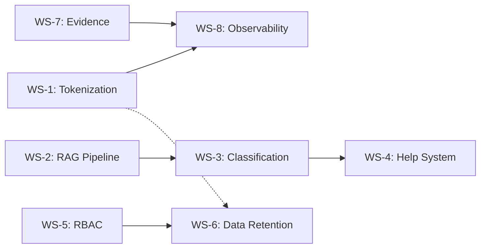

# Feature Completeness Plan — 5-Week Sprint

> **Goal:** Close the functional gaps between PRD/TDD specifications and the
> current implementation. The prior two sprints (Debt Remediation + Quality
> Elevation) focused on design coherency and implementation quality. This
> sprint shifts to **missing or weak functionality**: tokenization breadth,
> context-sensitive help, RAG pipeline completeness, classification maturity,
> RBAC, and data retention.
>
> **Created:** 2026-02-12
> **Last Updated:** 2026-02-14
> **Status:** COMPLETE
> **Predecessors:**
>
> - `planning/archive/debt_remediation_plan.md` (68 items — COMPLETE)
> - `planning/archive/quality_elevation_plan.md` (74 items — COMPLETE)

---

## How to Use This Document

- Each work stream (WS) is a logical unit of related changes.
- Work streams are ordered by priority (WS-1 first).
- Individual items have an F-number (F = "feature") for traceability.
- Status per item: `[ ]` not started, `[~]` in progress, `[x]` done.
- When starting a session, Copilot reads this file to know current position.
- After completing tasks, update the checkbox, add a date, and note decisions in
  the **Session Log** at the bottom.

---

## Summary

| #    | Work Stream                            | Items  | HIGH   | MED    | LOW   | Est. Days | Week | Status      |
| ---- | -------------------------------------- | ------ | ------ | ------ | ----- | --------- | ---- | ----------- |
| WS-1 | PII Tokenization Verification          | 8      | 4      | 3      | 1     | 3–4       | 1    | COMPLETE    |
| WS-2 | RAG Pipeline Completeness              | 6      | 3      | 2      | 1     | 3–4       | 1–2  | COMPLETE    |
| WS-3 | Classification & Risk Scoring          | 7      | 2      | 4      | 1     | 3–4       | 2    | COMPLETE    |
| WS-4 | Context-Sensitive Help System          | 8      | 2      | 4      | 2     | 4–5       | 2–3  | COMPLETE    |
| WS-5 | RBAC & Role Enforcement                | 7      | 3      | 3      | 1     | 3–5       | 3–4  | COMPLETE    |
| WS-6 | Data Retention & Compliance Automation | 6      | 2      | 3      | 1     | 3–4       | 4    | COMPLETE    |
| WS-7 | Evidence & Attachment Integrity        | 5      | 1      | 3      | 1     | 2–3       | 4–5  | COMPLETE    |
| WS-8 | Observability & Alerting               | 6      | 1      | 4      | 1     | 2–3       | 5    | COMPLETE    |
|      | **Totals**                             | **53** | **18** | **26** | **9** | **23–32** |      |             |

---

## WS-1: PII Tokenization Verification & Hardening

> **Priority:** CRITICAL — PRD FR-1 lists tokenization as P0 Critical Path.
> Current implementation covers email + IPv4 regex only. The PRD requires
> SSN, phone, credit card, address, DOB detection, plus LLM-assisted
> extraction for contextual patterns.
>
> **Estimated effort:** 3–4 days
> **Week:** 1
> **Repos:** `core/`

### Context

Tokenization is wired end-to-end: `TokenizationService` → `IngestPipeline` →
`PiiTokenStore` (SQLAlchemy) → API endpoints → UI detokenize action. The HMAC
scheme, vault storage, infra secrets, and ingestion integration all function.
However, `tokenize_text_content()` only scans for email and IPv4 — the PRD
requires much broader PII detection.

### Items

| #   | Finding                                                                                        | Severity | Status |
| --- | ---------------------------------------------------------------------------------------------- | -------- | ------ |
| F1  | `tokenize_text_content()` only detects email + IPv4 — missing SSN, phone, credit card, DOB     | HIGH     | [x]    |
| F2  | Phone normalization uses basic regex — TODO in code for `python-phonenumbers` E.164 formatting | HIGH     | [x]    |
| F3  | No LLM-assisted PII extraction for contextual patterns (PRD FR-1: "my SSN is...")              | HIGH     | [x]    |
| F4  | Email normalization missing Punycode/IDN handling (TODO in `normalization.py`)                 | MED      | [x]    |
| F5  | End-to-end smoke test: ingest a sample document, verify all PII types are tokenized            | HIGH     | [x]    |
| F6  | Address/street-address pattern detection not present                                           | MED      | [x]    |
| F7  | PII prefix catalog in TDD lists 40+ prefixes — verify code covers all active prefixes          | MED      | [x]    |
| F8  | Tokenization coverage metrics (observability.py) — wire to Cloud Monitoring                    | LOW      | [x]    |

### Design Decisions Required

- **F3:** LLM-assisted PII detection approach. Options:
  (a) Pre-scan text with a lightweight Gemini call using a detection prompt;
  (b) Use a dedicated NER model (spaCy/presidio) for PII entity recognition;
  (c) Hybrid — regex first, then LLM for contextual patterns only.
  ✅ **Decision (2026-02-13):** Option (c) hybrid approach implemented.
  Regex detectors run first (fast, high-precision). LLM detector runs on
  residual text only. Provider routing: **Ollama** in local env, **Gemini
  (Vertex AI)** in dev/prod — automatic via `settings.llm.provider`. Mock
  provider skips LLM detection entirely.
- **F1:** Regex patterns for SSN, credit card, DOB — use established patterns
  from libraries like `commonregex` or roll custom with test coverage.
  ✅ **Decision (2026-02-13):** Custom regex with Luhn validation for CC,
  area-number rejection for SSN, multi-format DOB patterns. All in
  `src/i4g/pii/detectors.py` with dedicated per-detector test coverage.

### Acceptance Criteria

- [x] `tokenize_text_content()` detects SSN, phone, credit card, DOB, address patterns.
- [x] Phone normalization uses `python-phonenumbers` for E.164 formatting.
- [x] LLM-assisted extraction handles contextual PII (design decision made + first pass implemented).
- [x] Smoke test passes: sample doc with all PII types → all tokenized.
- [x] Unit test coverage for each new PII pattern (≥2 test cases per pattern).
- [x] `pytest tests/unit` passes.

---

## WS-2: RAG Pipeline Completeness

> **Priority:** HIGH — RAG `pipeline.py` hardcodes Ollama; needs the same
> multi-provider switch as `classifier.py`. Output guardrails and citation
> support are described in the RAG TDD but not implemented.
>
> **Estimated effort:** 3–4 days
> **Week:** 1–2
> **Repos:** `core/`

### Context

The `HybridRetriever` and LCEL pipeline work. `classifier.py` already has
multi-provider LLM selection (Vertex AI / Ollama / mock). The RAG pipeline
in `pipeline.py` still hardcodes `ChatOllama`. This is a standing follow-up
in `roadmap.md`.

### Items

| #   | Finding                                                                               | Severity | Status |
| --- | ------------------------------------------------------------------------------------- | -------- | ------ |
| F9  | `pipeline.py` hardcodes `ChatOllama` — wire to `settings.llm.provider` multi-provider | HIGH     | [x]    |
| F10 | No structured JSON output guardrails (`is_scam`, `confidence`, `reasoning`)           | HIGH     | [x]    |
| F11 | No citation support — LLM should cite specific evidence chunks in responses           | HIGH     | [x]    |
| F12 | Few-shot learning: inject golden examples from `golden_examples.json` into prompt     | MED      | [x]    |
| F13 | RAG prompt template hardcoded — make configurable via settings or template file       | MED      | [x]    |
| F14 | RAG pipeline integration test with mock LLM provider                                  | LOW      | [x]    |

### Design Decisions Required

- **F10:** Output guardrails approach. Options:
  (a) LangChain `PydanticOutputParser` with retry;
  (b) Post-process LLM text with regex/JSON extraction;
  (c) Use Gemini structured output mode (JSON schema in request).
  Recommendation: (a) for portability across providers, with (c) as optimization for Vertex.
  ✅ **Decision (2026-02-13):** Option (a) implemented. `RagAssessment` Pydantic
  model (`is_scam`, `confidence`, `reasoning`, `citations`) enforced via
  `PydanticOutputParser`. Retry loop (up to 2 attempts) re-invokes the LLM
  with the validation error. JSON extraction handles markdown fences and
  surrounding prose. Vertex structured output mode deferred as future
  optimization. Pipeline supports `structured=True` (default) and
  `structured=False` (legacy) modes.
- **F11:** Citation format — inline bracketed references `[1]` with source
  chunk IDs, or a separate `citations` array in the structured output.
  ✅ **Decision (2026-02-13):** Both. Retrieved chunks formatted as
  `[n] source_id: content` in the prompt context. LLM populates
  `citations` array in `RagAssessment` with `chunk_id` + `excerpt`.
  `_format_retrieved_docs()` extracts source IDs from document metadata.

### Acceptance Criteria

- [x] `pipeline.py` uses `settings.llm.provider` to select LLM (Vertex / Ollama / mock).
- [x] RAG output is a validated Pydantic model with `is_scam`, `confidence`, `reasoning`, `citations`.
- [x] Golden examples injected as few-shot context when available.
- [x] Integration test with mock provider passes.
- [x] `pytest tests/unit` passes.

---

## WS-3: Classification & Risk Scoring

> **Priority:** HIGH — Fraud taxonomy TDD defines a risk scoring formula and
> analyst feedback loop. These are designed but unclear if fully operational.
>
> **Estimated effort:** 3–4 days
> **Week:** 2
> **Repos:** `core/`

### Context

The 5-axis classification model is implemented (SSOT YAML → generated code).
Pydantic models exist. The classification sweeper runs as a batch job. Risk
scoring (weighted sum × 2.5, capped at 100) is specified in the TDD but may
not be computed at runtime. Analyst feedback endpoint is designed but the
feedback → golden dataset pipeline may not be wired.

### Items

| #   | Finding                                                                               | Severity | Status |
| --- | ------------------------------------------------------------------------------------- | -------- | ------ |
| F15 | Risk scoring formula — verify it is computed and stored on each classification        | HIGH     | [x]    |
| F16 | Analyst feedback endpoint (`POST /reviews/{id}/feedback`) — verify wired + functional | HIGH     | [x]    |
| F17 | Feedback → golden dataset pipeline — corrections should feed back into examples       | MED      | [x]    |
| F18 | Classification regression tests against golden dataset                                | MED      | [x]    |
| F19 | Multi-label confidence display in UI — verify all 5 axes render in case detail        | MED      | [x]    |
| F20 | Taxonomy version header — API responses should declare taxonomy version               | MED      | [x]    |
| F21 | Sweeper job metrics — count of reclassified cases per run, drift detection            | LOW      | [x]    |

### Design Decisions Required

- **F15:** Where to store risk score — dedicated `risk_score` column on `cases`
  or `review_queue`, or computed field in the classification JSONB. Dedicated
  column is preferable for indexing/sorting.
  ✅ **Decision (2026-02-14):** Dedicated `risk_score` Numeric(5,1) column on
  `cases` table with index `idx_cases_risk_score`. Also added `taxonomy_version`
  column. Risk weights added to `definitions.yaml` for intents (5-10),
  techniques (4-9), and actions (6-9). Classifier fixed to key weights by code.
- **F17:** Feedback loop mechanics — manual curator review before promoting to
  golden dataset, or automatic promotion at high agreement threshold.
  ✅ **Decision (2026-02-14):** Manual curator review. Feedback writes to
  `golden_candidates.json` (not directly to `golden_examples.json`). A curator
  reviews candidates before promoting them to the golden dataset.

### Acceptance Criteria

- [x] Risk score computed on every classification and stored (queryable, sortable).
- [x] Analyst feedback endpoint accepts corrections and persists them.
- [x] At least 10 golden examples exist with regression test coverage.
- [x] UI case detail shows all 5 classification axes with confidence scores.
- [x] `pytest tests/unit` passes.

---

## WS-4: Context-Sensitive Help System

> **Priority:** MED-HIGH — The architecture doc envisions per-page contextual
> help, but no implementation exists. Currently a single static link to
> external GitBook docs in the sidebar.
>
> **Estimated effort:** 4–5 days
> **Week:** 2–3
> **Repos:** `core/`, `ui/`, `docs/`

### Context

Analyst workflows involve specialized terminology (tokenization, classification
axes, dossier generation) and multi-step processes. New volunteers need guidance
without leaving the console. The only current "help" is a `HelpCircle` icon
in the nav linking to `https://docs.intelligenceforgood.org/book/guides`.

### Items

| #   | Finding                                                                       | Severity | Status |
| --- | ----------------------------------------------------------------------------- | -------- | ------ |
| F22 | No help content architecture — design the system (API vs static vs embedded)  | HIGH     | [x]    |
| F23 | Create reusable `<HelpTooltip>` / `<InfoPopover>` components in `@i4g/ui-kit` | HIGH     | [x]    |
| F24 | Author help content for case review workflow (the most critical analyst path) | MED      | [x]    |
| F25 | Author help content for search & filtering (saved searches, search syntax)    | MED      | [x]    |
| F26 | Author help content for classification/taxonomy axes (what each axis means)   | MED      | [x]    |
| F27 | Add help trigger points to case detail page (field-level tooltips)            | MED      | [x]    |
| F28 | Add help trigger points to search page (filter explanations, search tips)     | LOW      | [x]    |
| F29 | Help content for dossier/report generation workflow                           | LOW      | [x]    |

### Design Decisions Required

- **F22:** Help content architecture. Options:
  (a) **Static JSON/MDX** — help entries keyed by page/field, bundled with UI build;
  (b) **API-served** — backend endpoint `/help/{topic}` serving markdown from docs repo;
  (c) **Embedded** — help text co-located with each component/page as constants.
  Recommendation: (a) static JSON with markdown content, co-located in
  `ui/apps/web/src/content/help/` — simple, versionable, no API overhead.
  Progressive enhancement to (b) later if content grows.
  ✅ **Decision: Option (a) implemented** — static TypeScript modules in
  `ui/apps/web/src/content/help/`, keyed by topic string, 36 entries across
  4 content modules (case-review, search, classification, dossier).
- **F23:** Component design — `<HelpTooltip>` for inline field help (hover/focus),
  `<InfoPopover>` for richer content with links. Both consume help content by key.
  ✅ **Decision: Implemented** — `<HelpTooltip>` (Radix Tooltip) and `<InfoPopover>`
  (Radix Popover) in `@i4g/ui-kit`. Wrapper components `<FieldHelp>` / `<SectionHelp>`
  in web app connect help registry to ui-kit primitives.

### Acceptance Criteria

- [x] Help content architecture documented and implemented.
- [x] `<HelpTooltip>` and `<InfoPopover>` components in `@i4g/ui-kit` with tests.
- [x] Case detail page has ≥5 contextual help trigger points.
- [x] Search page has ≥3 contextual help trigger points.
- [x] Classification axes have explanations accessible in-context.
- [x] `pnpm build` and `pnpm format` pass.

---

## WS-5: RBAC & Role Enforcement

> **Priority:** HIGH — Both WS-1 sprints flagged "all authenticated users get
> admin role" as a temporary measure. PRD FR-2 defines four roles (user,
> analyst, admin, leo) with row-level security.
>
> **Estimated effort:** 3–5 days
> **Week:** 3–4
> **Repos:** `core/`, `ui/`, `infra/`

### Context

IAP JWT verification is implemented, but the `require_role()` function in
`auth.py` currently grants admin to every authenticated user. The PRD defines
explicit roles with different permissions. The `accounts` table has a `role`
column. This is production-blocking for partnership readiness.

### Items

| #   | Finding                                                                                        | Severity | Status |
| --- | ---------------------------------------------------------------------------------------------- | -------- | ------ |
| F30 | `require_role()` grants admin to all authenticated users — implement actual role checking      | HIGH     | [x]    |
| F31 | Wire role from `accounts` table into JWT claims or session context                             | HIGH     | [x]    |
| F32 | Route-level authorization — restrict admin endpoints to admin role                             | HIGH     | [x]    |
| F33 | UI role-aware rendering — hide admin actions (user management, bulk ops) for non-admins        | MED      | [x]    |
| F34 | Role management API — `PUT /accounts/{id}/role` for admin to assign roles                      | MED      | [x]    |
| F35 | Audit log entries for role changes                                                             | MED      | [x]    |
| F36 | Row-level security — analysts see only assigned cases (configurable, can be relaxed for admin) | LOW      | [x]    |

### Design Decisions (Resolved)

- **F31:** Option **(a)** implemented — `_resolve_role()` in `auth.py` looks up
  `accounts.role` on every request via `AccountStore`. Auto-provisions new users
  with `DEFAULT_ROLE = analyst`. Lazy-loaded `AccountStore` singleton avoids
  repeated engine creation.
- **F36:** **"Team visibility"** model implemented — all authenticated users can
  view cases, but `_enforce_assignment()` in `review_queue.py` restricts
  annotate/feedback/decision actions to the assigned analyst or admins.

### Acceptance Criteria

- [x] `require_role()` checks actual role from `accounts` table.
- [x] Admin-only endpoints return 403 for non-admin users.
- [x] UI hides admin features from non-admin users.
- [x] Role assignment API works and logs audit events.
- [x] `pytest tests/unit` passes with role-aware test fixtures (635 passed, 0 failures).

### Implementation Summary

**Backend (`core/`):**

- `src/i4g/api/roles.py` — `Role` enum (user/analyst/admin/leo), `has_role()` hierarchy check
- `src/i4g/store/sql.py` — `accounts` table added (email PK, role, display_name, is_active)
- `src/i4g/store/account_store.py` — CRUD with auto-provision, role update with audit logging
- `src/i4g/api/auth.py` — rewritten to resolve role from DB; deactivated accounts get 403
- `src/i4g/api/accounts.py` — `/accounts/me`, `/accounts` (admin), role update, deactivation
- Route guards: campaigns create/update → admin, detokenize → analyst, task update → admin
- `src/i4g/api/review_queue.py` — `_enforce_assignment()` for annotate/feedback/decision

**Frontend (`ui/`):**

- `lib/auth-context.tsx` — `AuthProvider`, `useAuth()` hook with `hasRole()` + `isAdmin`
- `lib/server/user-service.ts` — `getCurrentUser()` server action
- Console layout wraps with `AuthProvider`; navigation filters items by `minRole`

**Tests (69 new, all passing):**

- `test_roles.py` (19), `test_auth_rbac.py` (9), `test_account_store.py` (17),
  `test_accounts_api.py` (12), `test_route_auth.py` (7)

---

## WS-6: Data Retention & Compliance Automation

> **Priority:** MED — PRD FR-9 is P1. Data retention is partially designed
> but no automated purge jobs exist. GDPR export/delete endpoints are
> specified but not implemented.
>
> **Estimated effort:** 3–4 days
> **Week:** 4
> **Repos:** `core/`, `infra/`

### Context

The PRD specifies 90-day retention post-resolution with automated purge,
GDPR export, and GDPR delete. None of these are currently implemented.
Cloud Scheduler can trigger Cloud Run Jobs for the purge.

### Items

| #   | Finding                                                                              | Severity | Status |
| --- | ------------------------------------------------------------------------------------ | -------- | ------ |
| F37 | Automated purge job — delete resolved cases older than retention window              | HIGH     | [x]    |
| F38 | Retention window configurable via settings (`storage.retention_days`, default 90)    | HIGH     | [x]    |
| F39 | GDPR data export endpoint — `GET /cases/{case_id}/export` returns full JSON          | MED      | [x]    |
| F40 | GDPR deletion endpoint — `DELETE /cases/{case_id}` hard deletes from SQL + PII vault | MED      | [x]    |
| F41 | Purge job also cleans PII vault tokens and GCS evidence files for purged cases       | MED      | [x]    |
| F42 | Cloud Scheduler trigger for daily purge run                                          | LOW      | [x]    |

### Design Decisions Required

- **F37:** Purge strategy — hard delete immediately, or soft-delete with a
  grace period. Recommendation: soft-delete with `purged_at` timestamp,
  hard delete in a second pass 30 days later (allows recovery from accidents).
  ✅ **Decision (2026-02-14):** Two-phase approach implemented per
  recommendation. Phase 1 soft-deletes resolved cases older than
  `retention_days` (default 90) by setting `is_deleted=True` +
  `deleted_at=now()`. Phase 2 hard-purges cases where `deleted_at` is
  older than `retention_grace_days` (default 30). New columns
  `resolved_at` and `purged_at` added to `cases` table. Service in
  `src/i4g/services/retention.py`, job in
  `src/i4g/worker/jobs/retention_purge.py`, CLI command
  `i4g jobs retention-purge [--dry-run]`.
- **F40:** GDPR delete scope — case data + PII tokens + GCS evidence +
  vector store entries. Must cascade correctly.
  ✅ **Decision (2026-02-14):** Full cascade implemented. GDPR delete
  (`DELETE /cases/{case_id}`) removes: case row (FK cascades to
  `source_documents`, `entities`, `indicators`, `entity_mentions`,
  `indicator_sources`), plus manual cleanup of `review_queue` →
  `review_actions`, `scam_records`, `intake_records` chain, PII vault
  tokens (via `SqlAlchemyPiiTokenStore.delete_tokens_for_case()`),
  evidence files (via `EvidenceStorage.delete()`), and vector embeddings
  (via `VectorStore.delete_record()`). Requires `admin` role. GDPR export
  (`GET /cases/{case_id}/export`) also requires `admin` role.

### Acceptance Criteria

- [x] Purge job deletes cases older than configured retention window.
- [x] GDPR export returns complete case data as JSON.
- [x] GDPR delete cascades to PII vault and evidence storage.
- [x] Retention window configurable via `I4G_STORAGE__RETENTION_DAYS`.
- [x] `pytest tests/unit` passes.

---

## WS-7: Evidence & Attachment Integrity

> **Priority:** MED — Roadmap standing follow-up to verify `source_url`
> attachment retrieval. Evidence chain-of-custody is required for LEO reports.
>
> **Estimated effort:** 2–3 days
> **Week:** 4–5
> **Repos:** `core/`

### Context

The `source_documents` table has a `source_url` column that should point to
original files in GCS or local FS. This has not been verified in the current
pipeline. LEO report generation depends on evidence file accessibility.

### Items

| #   | Finding                                                                                   | Severity | Status |
| --- | ----------------------------------------------------------------------------------------- | -------- | ------ |
| F43 | Verify `source_url` in `source_documents` correctly resolves to original evidence files   | HIGH     | [x]    |
| F44 | Evidence download endpoint — verify `/cases/{id}/evidence/{doc_id}` serves file correctly | MED      | [x]    |
| F45 | Chain-of-custody metadata — hash + timestamp on evidence files at ingestion               | MED      | [x]    |
| F46 | Batch evidence export for LEO investigations                                              | MED      | [x]    |
| F47 | Evidence file integrity check — scheduled verification of stored vs. expected hashes      | LOW      | [x]    |

### Design Decisions (Resolved)

- **F45:** Hash algorithm — **SHA-256** implemented per recommendation.
  New columns `file_sha256` (Text, nullable) and `ingested_at` (Timestamp)
  added to `source_documents` table. SHA-256 computed at save time via
  `EvidenceStorage.compute_sha256()` and persisted through
  `SourceDocumentPayload.file_sha256`. Ingestion timestamp auto-set to
  current UTC when not explicitly provided.
- **F46:** Batch export format — **ZIP archive with manifest JSON**
  implemented per recommendation. `GET /cases/{case_id}/evidence/export`
  returns a ZIP containing all retrievable evidence files plus a
  `manifest.json` with chain-of-custody metadata (document IDs, hashes,
  timestamps, sizes). Filename deduplication handles collisions.

### Acceptance Criteria

- [x] `source_url` resolves correctly for both GCS and local FS.
- [x] Evidence download works for all supported file types.
- [x] Ingested files have SHA-256 hash stored.
- [x] `pytest tests/unit` passes.

### Implementation Summary

**Evidence Storage (`core/src/i4g/storage/evidence.py`):**

- `RetrievedEvidence` dataclass — returned by `retrieve()` with data, filename, content type, size, SHA-256
- `EvidenceStorage.retrieve(uri)` — resolves local paths and `gs://` URIs, returns file data
- `EvidenceStorage.exists(uri)` — checks file existence without downloading
- `EvidenceStorage.compute_sha256(data)` — static helper for hash computation

**Schema Changes (`core/src/i4g/store/sql.py`, `sql_writer.py`):**

- `source_documents` table: added `file_sha256` (Text, nullable) and `ingested_at` (Timestamp, nullable)
- `SourceDocumentPayload`: added `file_sha256` and `ingested_at` fields
- `_persist_documents()`: writes new columns, defaults `ingested_at` to current timestamp

**API Endpoints (`core/src/i4g/api/evidence.py`):**

- `GET /cases/{case_id}/evidence` — list evidence metadata with availability check
- `GET /cases/{case_id}/evidence/export` — ZIP archive with manifest (analyst role)
- `GET /cases/{case_id}/evidence/{doc_id}` — download single evidence file (analyst role)

**Integrity Service (`core/src/i4g/services/evidence_integrity.py`):**

- `EvidenceIntegrityService.check_all(limit=)` — verify stored hashes vs actual files
- `EvidenceIntegrityService.backfill_hashes()` — fill missing `file_sha256` values

**Worker Job (`core/src/i4g/worker/jobs/evidence_integrity.py`):**

- CLI: `i4g jobs evidence-integrity [--backfill] [--limit N]`
- Exit codes: 0 = clean, 1 = storage failure, 2 = integrity mismatches

**Tests (22 new, all passing):**

- `test_evidence_integrity.py`: 5 retrieve, 3 chain-of-custody, 8 integrity,
  3 API/ZIP, 2 job, 1 dataclass

---

## WS-8: Observability & Alerting

> **Priority:** MED — Roadmap calls for wiring alerting for PII access,
> ingestion failures, and dossier verification. Current monitoring is basic.
>
> **Estimated effort:** 2–3 days
> **Week:** 5
> **Repos:** `core/`, `infra/`

### Context

Cloud Logging and Monitoring are configured. Structured JSON logs are emitted.
What's missing is targeted alerting for security-sensitive operations and
operational SLOs.

### Items

| #   | Finding                                                                           | Severity | Status |
| --- | --------------------------------------------------------------------------------- | -------- | ------ |
| F48 | PII access alerting — alert on detokenization calls above threshold per hour      | HIGH     | [x]    |
| F49 | Ingestion failure alerting — alert when ingestion error rate exceeds threshold    | MED      | [x]    |
| F50 | Dossier generation alerting — alert on stuck/failed dossier jobs                  | MED      | [x]    |
| F51 | Baseline SLO definitions — p95 latency, error rate, queue depth targets           | MED      | [x]    |
| F52 | Report generation progress — TASK_STATUS emits progress events (prep for Redis)   | MED      | [x]    |
| F53 | Dashboard for operational metrics (ingestion throughput, classification accuracy) | LOW      | [x]    |

### Design Decisions (Resolved)

- **F48:** ✅ **>10 detokenization calls per user per hour** (configurable via
  `I4G_OBSERVABILITY__DETOKENIZATION_ALERT_THRESHOLD`). Implemented as
  in-process sliding window in `AlertingService`. Structured log events with
  `alert=true, alert_type="pii_access"` are matched by a Cloud Monitoring
  log-based metric + alert policy in `infra/modules/monitoring/`.
- **F51:** ✅ **Aligned with PRD NFR-1.** SLO document at
  `docs/book/config/slo_definitions.md` defines API p95 < 2s, LLM < 5s,
  dashboard < 3s, error rate < 1%, ingestion failure < 5%, dossier p95 < 10 min,
  detokenization ≤ 10 calls/user/hour.

### Acceptance Criteria

- [x] PII access alert fires when detokenization calls exceed threshold.
- [x] Ingestion failure alert fires on sustained error rate.
- [x] SLO document with measurable targets exists.
- [x] `pytest tests/unit` passes (707 passed, 0 failures).

### Implementation Summary

**Alerting Service (`core/src/i4g/services/alerting.py`):**

- `AlertingService` — Thread-safe singleton with per-actor sliding-window
  detokenization tracking (F48), batch ingestion error-rate check (F49),
  dossier stuck-job detection and failure reporting (F50).
- Alert events emitted as structured JSON logs with `alert=true` +
  `alert_type` fields for Cloud Monitoring log-based metric matching.
- Configurable thresholds via `ObservabilitySettings` with env-var overrides.

**Settings (`core/src/i4g/settings/sections/jobs.py`):**

- `detokenization_alert_threshold` (default 10, env `OBS_DETOKENIZATION_ALERT_THRESHOLD`)
- `ingestion_error_rate_threshold` (default 0.10, env `OBS_INGESTION_ERROR_RATE_THRESHOLD`)
- `dossier_stuck_timeout_minutes` (default 30, env `OBS_DOSSIER_STUCK_TIMEOUT_MINUTES`)

**Wiring:**

- `api/tokenization.py` — detokenize endpoint calls `check_detokenization_rate()`
- `worker/jobs/ingest.py` — batch end calls `check_ingestion_error_rate()` + emits
  `ingestion.records.processed/failed/retries_scheduled` metrics
- `worker/jobs/report.py` — periodic `check_dossier_job()` + `report_dossier_failure()`
- `worker/jobs/classification_sweeper.py` — emits sweeper metrics (processed,
  classified, errors, intent distribution, duration)

**Task Status Progress (F52, `core/src/i4g/task_status.py`):**

- `TaskStatusReporter.update()` now emits `task.progress` structured log events
  and `task.status.update` counters via `Observability` — queryable in Cloud
  Logging for task lifecycle audit trail.

**SLO Definitions (F51, `docs/book/config/slo_definitions.md`):**

- Baseline targets for API latency, error rates, queue depth, PII access,
  and mobile performance aligned with PRD NFR-1.

**Terraform Monitoring (`infra/modules/monitoring/`):**

- Email notification channel, 3 log-based metrics (`pii_access_alert`,
  `ingestion_failure_alert`, `dossier_alert`), 3 alert policies with
  documentation and configurable thresholds.

**Tests (30 new, all passing):**

- `test_alerting.py` (17): 5 detokenization, 5 ingestion, 5 dossier, 2 singleton
- `test_task_status_progress.py` (6): progress event emission, counter, filtering
- `test_observability_settings.py` (7): defaults + env-var overrides

---

## Schedule Overview

```
Week 1  ─── WS-1: PII Tokenization Verification ─────────────────┐
         ── WS-2: RAG Pipeline Completeness (start) ──────────────┤
                                                                   │
Week 2  ─── WS-2: RAG Pipeline Completeness (finish) ─────────────┤
         ── WS-3: Classification & Risk Scoring ──────────────────┤
         ── WS-4: Context-Sensitive Help (start) ─────────────────┤
                                                                   │
Week 3  ─── WS-4: Context-Sensitive Help (finish) ────────────────┤
         ── WS-5: RBAC & Role Enforcement (start) ────────────────┤
                                                                   │
Week 4  ─── WS-5: RBAC & Role Enforcement (finish) ───────────────┤
         ── WS-6: Data Retention & Compliance ────────────────────┤
         ── WS-7: Evidence & Attachment Integrity (start) ─────────┤
                                                                   │
Week 5  ─── WS-7: Evidence & Attachment Integrity (finish) ────────┤
         ── WS-8: Observability & Alerting ────────────────────────┘
```

---

## Dependencies



- **WS-1 → WS-8:** Tokenization observability feeds into alerting.
- **WS-2 → WS-3:** RAG output guardrails inform classification pipeline.
- **WS-3 → WS-4:** Classification axis definitions inform help content.
- **WS-5 → WS-6:** RBAC controls who can trigger purge/delete operations.
- **WS-1 ⇢ WS-6:** PII vault purge must respect tokenization integrity.

---

## Session Log

_Record decisions, blockers, and progress here as work proceeds._

| Date       | WS   | Notes                                                                                                                                                                                                                                                                                                                                                                                                                                                                                                                                                                                                                                                                                                                                                                                                                                                                                                                                                                                                                                                                                                                                                                                                                                                                                                                                                                                                                                                                                                                                                                                                                                                                                                                                                                                                                                                                                  |
| ---------- | ---- | -------------------------------------------------------------------------------------------------------------------------------------------------------------------------------------------------------------------------------------------------------------------------------------------------------------------------------------------------------------------------------------------------------------------------------------------------------------------------------------------------------------------------------------------------------------------------------------------------------------------------------------------------------------------------------------------------------------------------------------------------------------------------------------------------------------------------------------------------------------------------------------------------------------------------------------------------------------------------------------------------------------------------------------------------------------------------------------------------------------------------------------------------------------------------------------------------------------------------------------------------------------------------------------------------------------------------------------------------------------------------------------------------------------------------------------------------------------------------------------------------------------------------------------------------------------------------------------------------------------------------------------------------------------------------------------------------------------------------------------------------------------------------------------------------------------------------------------------------------------------------------------- |
| 2026-02-13 | WS-1 | All 8 items (F1–F8) implemented. New modules: `detectors.py` (regex pipeline with SSN, CC, phone, DOB, address, email, IPv4), `llm_detector.py` (hybrid LLM extraction — Ollama local, Vertex AI dev/prod, mock skip). Updated `normalization.py` (phonenumbers E.164, Punycode/IDN email, CCN normalizer). Expanded `_ENTITY_PREFIX_MAP` to 40+ entity types. Added `phonenumbers>=8.13` to deps. Observability: `record_detector_confidence()` now called per-match. **71 PII tests pass**; full suite 514 passed (2 pre-existing failures unrelated to WS-1).                                                                                                                                                                                                                                                                                                                                                                                                                                                                                                                                                                                                                                                                                                                                                                                                                                                                                                                                                                                                                                                                                                                                                                                                                                                                                                                       |
| 2026-02-13 | WS-2 | F10 implemented. New modules: `rag/models.py` (RagAssessment + CitationSource Pydantic models), `rag/output_parser.py` (PydanticOutputParser with retry — JSON fence extraction, retry-with-LLM loop). Updated `rag/pipeline.py` — structured output now default (returns `RagAssessment`), legacy `structured=False` path preserved. **21 RAG tests pass** (19 parser/model + 2 pipeline); full suite 538 passed.                                                                                                                                                                                                                                                                                                                                                                                                                                                                                                                                                                                                                                                                                                                                                                                                                                                                                                                                                                                                                                                                                                                                                                                                                                                                                                                                                                                                                                                                     |
| 2026-02-13 | WS-2 | F9/F11/F12/F13/F14 implemented — WS-2 COMPLETE. **F9:** Removed hardcoded `ChatOllama` import; `build_langchain_llm()` now returns `MockLangChainLLM` for mock provider (no more `None` fallback). Non-Runnable adapters (Vertex, Mock) auto-wrapped via `RunnableLambda`. **F11:** `_format_retrieved_docs()` numbers chunks as `[n] source_id: content`; prompt instructs LLM to populate `citations` array. **F12:** RAG-specific golden examples in `rag/golden_examples.json` (3 exemplars: crypto scam, legitimate, grandparent scam); injected via `_format_golden_examples()`. **F13:** External prompt template at `llm/prompts/rag_assessment.md` with `{{ }}` placeholders; loaded at chain-build time with built-in fallback. **F14:** Full integration test (`test_pipeline.py`) — 13 new tests covering doc formatting, template/example loading, structured + legacy end-to-end paths. **32 RAG tests pass**; full suite **551 passed**, 0 failed.                                                                                                                                                                                                                                                                                                                                                                                                                                                                                                                                                                                                                                                                                                                                                                                                                                                                                                                      |
| 2026-02-13 | WS-4 | F22–F29 implemented — WS-4 COMPLETE. **F22:** Static TS help architecture in `ui/apps/web/src/content/help/` — registry with `HelpEntry` type, keyed lookup via `getHelpEntry()`, 36 entries across 4 content modules. **F23:** `<HelpTooltip>` (Radix Tooltip) and `<InfoPopover>` (Radix Popover) added to `@i4g/ui-kit`; Radix deps as peerDependencies to avoid React duplication. Wrapper components `<FieldHelp>` / `<SectionHelp>` in web app. **F24:** 10 case-review help entries (narrative, timeline, status, priority, classification, risk score, taxonomy, artifacts, feedback). **F25:** 11 search help entries (query syntax, filters, campaigns, indicators, datasets, time range, entities, saved searches, history, suggestions). **F26:** 9 classification entries (overview, 5 axes, risk score formula, confidence, sweeper). **F27:** 8 help trigger points on case detail page. **F28:** 4 help trigger points on search page (query input, filters, indicators, entities). **F29:** 6 dossier help entries (overview, generation, status, verification, LEO report, PII handling). **22 new tests pass** (13 registry + 9 component); full UI suite **98 passed**, 0 failed. TypeScript clean, `pnpm format` clean. Also corrected WS-3 summary status to COMPLETE (all items were already [x]).                                                                                                                                                                                                                                                                                                                                                                                                                                                                                                                                                              |
| 2026-02-14 | WS-7 | F43–F47 implemented — WS-7 COMPLETE. **F43:** `EvidenceStorage.retrieve()` and `exists()` added — resolves `source_url` for both local FS paths and `gs://` URIs. `RetrievedEvidence` dataclass returns file data, name, content type, size, and SHA-256. **F44:** `GET /cases/{case_id}/evidence/{doc_id}` endpoint serves evidence files (analyst role). Resolves `source_url` from `source_documents`, retrieves file from storage backend, returns with content-disposition and `X-Evidence-SHA256` header. **F45:** `file_sha256` (Text) and `ingested_at` (Timestamp) columns added to `source_documents` table. `SourceDocumentPayload` updated with new fields; `_persist_documents()` writes them on ingestion. `EvidenceStorage.compute_sha256()` static method for hash computation. **F46:** `GET /cases/{case_id}/evidence/export` returns ZIP archive with all evidence files + `manifest.json` (analyst role). Manifest includes document IDs, SHA-256 hashes, timestamps, sizes. Filename deduplication for collisions. **F47:** `EvidenceIntegrityService` in `services/evidence_integrity.py` — `check_all()` compares stored `file_sha256` against actual file hashes, `backfill_hashes()` fills missing values. Worker job `worker/jobs/evidence_integrity.py`, CLI `i4g jobs evidence-integrity [--backfill] [--limit N]`. Returns exit code 2 on mismatches. **22 new tests pass** (5 retrieve, 3 chain-of-custody, 8 integrity, 3 API/ZIP, 2 job, 1 dataclass); full suite **677 passed**, 1 skipped.                                                                                                                                                                                                                                                                                                                                                           |
| 2026-02-14 | WS-6 | F37–F42 implemented — WS-6 COMPLETE. **F38:** `retention_days` (default 90) and `retention_grace_days` (default 30) added to `StorageSettings` with env var overrides `I4G_STORAGE__RETENTION_DAYS` / `I4G_STORAGE__RETENTION_GRACE_DAYS`. **F37:** Two-phase purge: `RetentionService` in `services/retention.py` — Phase 1 soft-deletes resolved cases (status ∈ {closed, accepted, rejected}) older than `retention_days` via `is_deleted`/`deleted_at` columns; Phase 2 hard-purges soft-deleted cases older than `retention_grace_days`. New columns `resolved_at` and `purged_at` on `cases` table. Worker job `worker/jobs/retention_purge.py`, CLI `i4g jobs retention-purge [--dry-run]`. **F41:** Cascade cleanup: `SqlAlchemyPiiTokenStore.delete_tokens_for_case()` purges PII vault tokens; `EvidenceStorage.delete()` / `delete_by_prefix()` removes local + GCS evidence files; `VectorStore.delete_record()` cleans embeddings. Manual cleanup for `review_queue` → `review_actions`, `scam_records`, `intake_records` chain (no FK cascade on these). **F39:** `GET /cases/{case_id}/export` returns full JSON export (case, source_documents, reviews, scam_records, intake_records, PII token metadata). Requires `admin` role. **F40:** `DELETE /cases/{case_id}` immediate hard-delete with full cascade. Requires `admin` role. **F42:** Terraform `retention_purge` entry in `infra/environments/app/dev/terraform.tfvars` — reuses `ingest-job:dev` image with `args=["jobs", "retention-purge"]`, scheduled daily at `0 3 * * *` UTC. **20 new tests pass** (18 retention service + 2 settings override); full suite **657 passed**, 1 skipped.                                                                                                                                                                                                               |
| 2026-02-14 | WS-8 | F48–F53 implemented — WS-8 COMPLETE. **F48:** `AlertingService` in `services/alerting.py` — thread-safe singleton with per-actor sliding-window detokenization tracking; fires structured log alert (`alert=true, alert_type=pii_access`) when calls exceed threshold (default 10/hour, configurable via `OBS_DETOKENIZATION_ALERT_THRESHOLD`). Wired into `api/tokenization.py` detokenize endpoint. **F49:** `check_ingestion_error_rate()` in `AlertingService` — fires alert when batch failure rate exceeds threshold (default 10%, `OBS_INGESTION_ERROR_RATE_THRESHOLD`). Wired into `worker/jobs/ingest.py` at batch completion; also emits `ingestion.records.processed/failed/retries_scheduled` operational metrics. **F50:** `check_dossier_job()` + `report_dossier_failure()` in `AlertingService` — detects stuck jobs (default 30 min, `OBS_DOSSIER_STUCK_TIMEOUT_MINUTES`) and fires per-review failure alerts. Wired into `worker/jobs/report.py`. **F51:** SLO baseline document at `docs/book/config/slo_definitions.md` — API p95 < 2s, LLM p95 < 5s, dashboard p95 < 3s, error rate < 1% 5xx, ingestion < 5% failure, dossier p95 < 10 min, detokenization ≤ 10/user/hour. Aligned with PRD NFR-1. **F52:** `TaskStatusReporter.update()` now emits `task.progress` structured log events + `task.status.update` counter metrics via `Observability` — queryable in Cloud Logging for task lifecycle audit trail. **F53:** Operational metrics wired into `worker/jobs/ingest.py` (throughput counters) and `worker/jobs/classification_sweeper.py` (processed, classified, errors, per-intent distribution, duration). Terraform `infra/modules/monitoring/` — 3 log-based metrics + 3 alert policies + email notification channel. **30 new tests pass** (17 alerting, 6 task-status progress, 7 observability settings); full suite **707 passed**, 1 skipped. |
