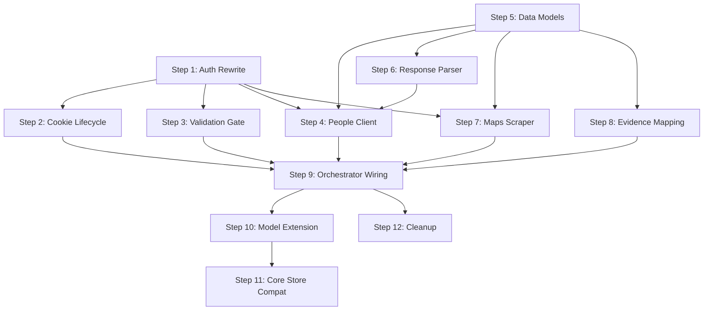

# Plan: Native Google OSINT Scrapers [DEPRECATED & DELETED]

> [!WARNING]
> **DEPRECATION & REMOVAL NOTICE (2026-06-18):**
> The native Google OSINT scraper module (Phase 2.7) has been completely deprecated and removed from the SSI repository.
> This document remains for historical reference only. None of the described plans, auth managers, endpoints, or lifecycles are active.

> **Owner:** Product + Architecture Lead
> **Repos:** `ssi/`, `core/`
> **Status:** Deprecated & Deleted

---

## 1. Executive Summary

**Objective:** Build a native Google identity intelligence capability into SSI that, given an email address or Google Drive link found on a scam site, can:

1. Resolve the email → Google Account ID → profile metadata (display name, profile photo, cover photo, activated services, user type, last edit timestamp).
2. Scrape Google Maps contribution statistics tied to that account (reviews, ratings, photos counts) and calculate probable geographic locations.
3. Resolve Google Drive file/folder metadata (owner, editors, commenters, creation/modification dates, source app, sharing permissions).
4. Route all discovered identifiers (account IDs, secondary emails, locations) into the SSI evidence pipeline as `ThreatIndicator` and `PiiExposure` records.

**Why native?** The open-source tool we evaluated has an authentication model that requires a browser extension companion + Android master tokens — a flow incompatible with SSI's headless worker architecture. We take only the *ideas* (which Google internal APIs to call, what data structures to parse) and build from scratch using SSI's existing `zendriver` browser session for cookie extraction.

---

## 2. Current State Assessment

### 2.1 What Exists Today (and What's Wrong)

The prior implementation attempt created files but they are **non-functional stubs with critical bugs**:

| File | Issue |
|---|---|
| [auth.py](file:///Users/jerry/Work/project/i4g/ssi/src/ssi/osint/google/auth.py) | Extracts only `SAPISID` and `authuser` — missing `SID`, `HSID`, `SSID`, `APISID` cookies required for real Google API calls. The `generate_sapisidhash` output format is wrong. |
| [people.py](file:///Users/jerry/Work/project/i4g/ssi/src/ssi/osint/google/people.py) | Hits `people.googleapis.com/v1/people:search` — a public API that requires OAuth2 bearer tokens, **not** SAPISIDHASH. The correct endpoint is `people-pa.clients6.google.com/v2/people/lookup` with completely different request/response shapes. |
| [maps.py](file:///Users/jerry/Work/project/i4g/ssi/src/ssi/osint/google/maps.py) | Hits the **Places API** (`findplacefromtext`) — this has nothing to do with user contribution/review scraping. The actual approach uses `/locationhistory/preview/mas` with protobuf-encoded parameters. |
| [drive.py](file:///Users/jerry/Work/project/i4g/ssi/src/ssi/osint/google/drive.py) | Uses Drive API v3 public endpoint — requires OAuth bearer token. The working approach uses `v2internal` endpoints with OAuth from Android master tokens. |
| [orchestrator.py](file:///Users/jerry/Work/project/i4g/ssi/src/ssi/investigator/orchestrator.py) L319 vs L613 | **Signature mismatch crash:** `_run_google_osint(result, agent_session)` called with 2 args but defined with only 1 (`result`). |
| [ghunt.py](file:///Users/jerry/Work/project/i4g/ssi/src/ssi/osint/ghunt.py) | Dead stub with hardcoded `ProviderGate` — returns empty results. |
| [mapping.py](file:///Users/jerry/Work/project/i4g/ssi/src/ssi/evidence/mapping.py) | Expects `searchResults[].person.emailAddresses` — a shape that doesn't match the internal People API response. |

> [!CAUTION]
> **None of the existing Google OSINT code produces real results.** Every scraper hits the wrong endpoint, uses the wrong auth, and parses non-existent response shapes. The orchestrator has a crash bug. This is a greenfield rewrite.

### 2.2 Architecture Constraints

- **Auth source:** SSI's `ZenBrowserManager` drives a Chromium instance. The session *may* have valid Google cookies. Cookie extraction must happen **before** the browser closes after Phase 2.
- **Worker lifecycle:** The orchestrator closes the browser after Phase 2 capture. Google OSINT runs at Phase 2.7 — browser is gone. We must extract cookies during Phase 2.
- **Resilience:** All network calls must use `@with_retries`. Failures must never halt the broader investigation.
- **Store patterns:** Results flow through `InvestigationResult.threat_indicators` and `.pii_exposures`, then persist via `scan_store.persist_investigation()`.

---

## 3. Architecture Decision: Auth Strategy

### Option A: Cookie-Only (SAPISIDHASH) — **Recommended for Phase 1**

Extract Google session cookies from zendriver during active investigation. Use SAPISIDHASH-authenticated requests for People and Maps.

**Pros:** No external dependencies, works with existing browser session.
**Cons:** Requires a logged-in Google profile. Cannot access Drive v2internal (needs OAuth).

### Option B: Service Account OAuth — **Future Phase**

Use a Google Workspace service account with domain-wide delegation.

**Pros:** Stable tokens, no browser dependency.
**Cons:** Requires Workspace admin setup, limited to directory contacts.

> [!IMPORTANT]
> **Decision:** Phase 1 = Cookie-only for People + Maps. Skip Drive for now. Drive requires Android OAuth master tokens — defer to future work.

---

## 4. Phased Execution Plan

### Phase 1: Auth Foundation & Cookie Lifecycle (Steps 1–3)

#### Step 1: Rewrite `GoogleAuthManager`

**Target:** `ssi/src/ssi/osint/google/auth.py`

Replace the current stub with a complete implementation:

- **Required cookies:** `SID`, `HSID`, `SSID`, `APISID`, `SAPISID`, `NID`
- **SAPISIDHASH:** `SHA1(timestamp + " " + SAPISID + " " + origin)` → `"SAPISIDHASH {timestamp}_{sha1_hex}"`
- Key methods:
  - `extract_auth_cookies(browser) → dict[str, str]`
  - `generate_sapisidhash(sapisid, origin) → str`
  - `build_authenticated_headers(origin) → dict[str, str]`
  - `are_cookies_valid() → bool` — validate via `accounts.google.com/CheckCookie`

**Acceptance:** Unit test with mocked cookies produces correct SAPISIDHASH. Integration test validates cookie check returns 302.

#### Step 2: Cookie Extraction Lifecycle in Orchestrator

**Target:** `ssi/src/ssi/investigator/orchestrator.py`

Fix the browser lifecycle issue:

1. Extract Google auth cookies from `ZenBrowserManager` **before** browser closes after Phase 2.
2. Pass cookies to Phase 2.7.
3. Fix the `_run_google_osint` signature mismatch.

```python
# After Phase 2, before browser close:
google_cookies = _extract_google_cookies(agent_session)
# Phase 2.7 — fix signature:
_run_google_osint(result, google_cookies=google_cookies)
```

**Acceptance:** `_run_google_osint` is called without a crash. Cookies are available at Phase 2.7.

#### Step 3: Credential Validation Gate

**Target:** `ssi/src/ssi/osint/google/auth.py`

Fast-fail check: if cookies are missing or invalid, skip all Google OSINT gracefully (warning log, empty results).

**Acceptance:** Empty cookies → immediate return with warning, no exceptions.

---

### Phase 2: Identity Resolution Scraper (Steps 4–6)

#### Step 4: People Lookup Client

**Target:** `ssi/src/ssi/osint/google/people.py`

Rewrite to hit the correct internal endpoint:

- **Endpoint:** `https://people-pa.clients6.google.com/v2/people/lookup`
- **Auth:** SAPISIDHASH
- **Method:** GET
- **Email → Account ID params:** `id={email}`, `type=EMAIL`, `matchType=EXACT`, `requestMask.includeField.paths=person.metadata`
- **Full profile params:** Same endpoint with extended `request_mask.include_field.paths` covering `person.photo`, `person.name`, `person.in_app_reachability`, `person.read_only_profile_info`, `person.metadata`, etc.
- **Account-ID-to-profile:** `https://people-pa.clients6.google.com/v2/people` with `person_id={account_id}`

**Acceptance:** Given a valid email, returns structured `PersonProfile` with `account_id`, `user_types`, `activated_services`, `profile_photo_url`, `last_updated`.

#### Step 5: Person Data Models

**Target:** `ssi/src/ssi/osint/google/models.py` (new file)

```python
class PersonProfile(BaseModel):
    account_id: str = ""
    email: str = ""
    display_name: str = ""
    profile_photo_url: str = ""
    cover_photo_url: str = ""
    is_default_photo: bool = True
    last_updated: datetime | None = None
    user_types: list[str] = []
    activated_services: list[str] = []
    entity_type: str = ""
    customer_id: str = ""
    is_enterprise_user: bool = False

class MapContributionStats(BaseModel):
    reviews: int = 0
    ratings: int = 0
    photos: int = 0
    profile_url: str = ""

class GoogleOSINTResult(BaseModel):
    profiles: list[PersonProfile] = []
    map_stats: list[MapContributionStats] = []
```

**Acceptance:** Models serialize cleanly to JSON and are importable from `ssi.osint.google.models`.

#### Step 6: Response Parser

**Target:** `ssi/src/ssi/osint/google/parsers.py` (new file)

Parse raw Google internal API JSON into Pydantic models. Handle:
- `personId` from metadata
- `sourceIds` → `PROFILE` container
- `readOnlyProfileInfo` → `ownerUserType`
- `inAppReachability` → activated services
- `extendedData.dynamiteExtendedData` → entity type / customer ID
- `photo` and `coverPhoto` arrays

**Acceptance:** Parser handles both "found" and "not found" responses. Unit tests with fixture JSON.

---

### Phase 3: Maps & Evidence Pipeline (Steps 7–9)

#### Step 7: Maps Contribution Scraper

**Target:** `ssi/src/ssi/osint/google/maps.py`

Rewrite to hit the correct endpoint:

- **Endpoint:** `https://www.google.com/locationhistory/preview/mas`
- **Auth:** Cookie-based (session cookies, no SAPISIDHASH)
- **Params:** `authuser=0&hl=en&gl=us&pb={protobuf_template.format(account_id)}`
- **Response:** JSONP-like — strip `)]}'\n` prefix, then parse JSON. Stats at `data[16][8][0]`.

Phase 1 extracts **stats only** (reviews, ratings, photos counts). Full review enumeration with location clustering deferred.

**Acceptance:** Given valid account ID, returns `MapContributionStats`. Handles `302` (IP blocked) and empty responses gracefully.

#### Step 8: Evidence Mapping Rewrite

**Target:** `ssi/src/ssi/evidence/mapping.py`

Rewrite `route_google_osint_results` to accept `GoogleOSINTResult`:

Mapping rules:
- `PersonProfile.account_id` → `ThreatIndicator(indicator_type="google_account_id")`
- Non-primary emails → `PiiExposure(field_type="email")`
- `MapContributionStats` with reviews > 0 → `ThreatIndicator(indicator_type="google_maps_profile")`

**Acceptance:** Unit tests verify correct indicator/exposure generation from fixture data.

#### Step 9: Orchestrator Wiring Fix

**Target:** `ssi/src/ssi/investigator/orchestrator.py`

Rewrite `_run_google_osint`:
1. Accept `result` + `google_cookies`.
2. Extract emails/Drive links from DOM + agent steps (existing logic is OK).
3. Create `GoogleAuthManager(cookies=google_cookies)`, validate.
4. For each email: People scraper → Maps scraper (if account ID found).
5. Aggregate into `GoogleOSINTResult`, route through evidence mapping.

Also:
- Remove `nest_asyncio` hack — use proper async integration.
- Delete `osint/ghunt.py`.
- Remove `"ghunt"` from `PHISHDESTROY_PROVIDERS` in `osint/__init__.py`.

**Acceptance:** End-to-end: orchestrator Phase 2.7 runs without crash, produces indicators when valid cookies + Gmail present.

---

### Phase 4: Data Persistence & Cleanup (Steps 10–12)

#### Step 10: Investigation Model Extension

**Target:** `ssi/src/ssi/models/investigation.py`

Add to `InvestigationResult`:

```python
google_osint: GoogleOSINTResult | None = None
```

**Acceptance:** Serialization tests pass. New field appears in `investigation.json`.

#### Step 11: Core Store Schema Compatibility

**Target:** `core/src/i4g/store/sql.py`

Verify `persist_investigation` handles the new `google_osint` JSONB block. Confirm backward compatibility — older records without the key must still deserialize.

**Acceptance:** Result with `google_osint` persists and retrieves. Result without it also works.

#### Step 12: Cleanup & Documentation

- Delete `ssi/src/ssi/osint/ghunt.py`
- Remove `"ghunt"` from `PHISHDESTROY_PROVIDERS`
- Update `ssi/README.md` OSINT section
- Add docstrings to all new modules

**Acceptance:** `grep -r "ghunt" ssi/src/` returns zero results.

---

## 5. Risk Register

| Risk | Likelihood | Impact | Mitigation |
|---|---|---|---|
| Google changes internal People API response shape | Medium | High | Parser uses `.get()` with defaults. Monthly smoke test. |
| Worker browser has no Google session cookies | High | Medium | Graceful skip with warning. Feature is opportunistic. |
| IP rate-limiting / CAPTCHA from Maps endpoint | Medium | Medium | `@with_retries` with backoff. Future: proxy rotation. |
| Maps protobuf template breaks | Medium | High | Static constant, easy to update. Monitor for `302`s. |
| JSONB schema change breaks older core records | Low | High | New field is additive and `Optional`. |

---

## 6. Execution Order & Dependencies



**Parallelizable:** Steps 1 and 5 can start immediately. Steps 4, 6, 7 depend on 1+5 but are independent of each other. Step 9 is the integration bottleneck.

---

## 7. Out of Scope (Future Work)

- **Drive file metadata scraping** — Requires Android OAuth master token flow
- **Full Maps review/photo enumeration** — Paginated review scraping with location clustering
- **Google Calendar scraping** — Lower priority signal
- **Play Games profile scraping** — Niche signal, low ROI
- **Geolocation (BSSID → lat/lng)** — Requires Google Geolocation API key
- **Proxy rotation** — Needed for scale but not MVP

---

## 8. Handoff Strategy

**Decision: Phased PRs**

| PR | Phase | Steps | Focus |
|---|---|---|---|
| PR 1 | Phase 1 | 1–3 | Auth + cookie lifecycle |
| PR 2 | Phase 2 | 4–6 | People scraper + models + parser |
| PR 3 | Phase 3 | 7–9 | Maps + evidence mapping + orchestrator |
| PR 4 | Phase 4 | 10–12 | Persistence + cleanup |

Each PR must include unit tests and pass existing CI.

---

## 9. Tracking

- [x] Step 1: Rewrite GoogleAuthManager
- [x] Step 2: Cookie extraction lifecycle in orchestrator
- [x] Step 3: Credential validation gate
- [x] Step 4: People lookup client
- [x] Step 5: Person data models
- [x] Step 6: Response parser
- [x] Step 7: Maps contribution scraper
- [x] Step 8: Evidence mapping rewrite
- [x] Step 9: Orchestrator wiring fix
- [x] Step 10: Investigation model extension
- [x] Step 11: Core store schema compatibility
- [x] Step 12: Cleanup & documentation
