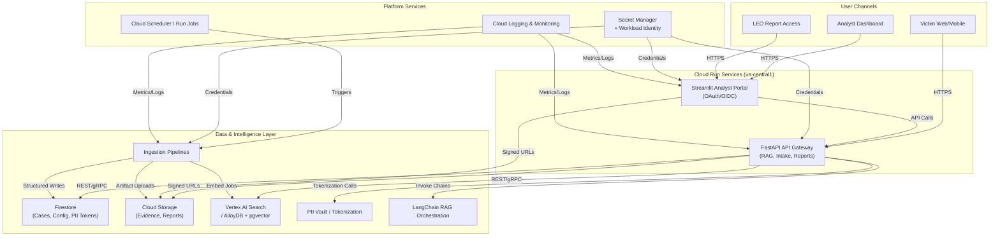
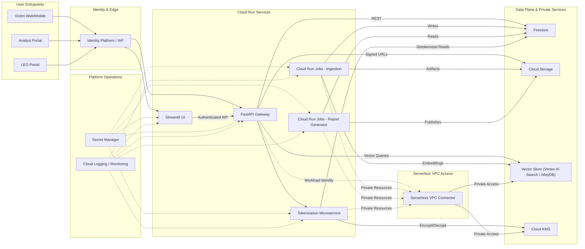

# Future-State Architecture (DT-IFG → i4g, GCP-Only, Open-Friendly)

_Last updated: 15 Nov 2025_

This document sketches the proposed end-state architecture that replaces DT-IFG’s Azure/GCP hybrid with an all-GCP stack while embracing open standards and minimal vendor lock-in. It reflects the technology evaluations in `technology_evaluation.md` and addresses the gaps identified in `gap_analysis.md`.

## 1. Guiding Objectives

1. **Parity before cutover**: Match or exceed DT-IFG capabilities across ingestion, chat, search, reporting.
2. **Open-first**: Prefer open protocols, OSS-compatible services, or managed offerings that allow future portability.
3. **Volunteer-friendly operations**: Low administrative burden, clear runbooks.
4. **Privacy & security**: Enforce tokenized PII handling, least-privilege IAM, auditable access.
5. **Cost control**: Stay within free tier/nonprofit credits until scale requires upgrades.

## 2. High-Level Topology

### 2.1 Cloud Run Deployment Swimlanes

The swimlanes emphasize the Cloud Run deployment boundary: user requests traverse Identity-Aware Proxy (IAP) before reaching the stateless FastAPI and Streamlit services, while background Cloud Run jobs handle ingestion and reporting. Secrets flow from Secret Manager into each workload via Workload Identity Federation, and the shared VPC connector enables private access to the vector store or KMS when those resources require it. Observability remains centralized through Cloud Logging and Monitoring across all containers.

## 3. Key Components

### 3.1 Identity & Access Control
- **Primary option**: Google Cloud Identity Platform (OIDC) with custom user attributes for roles (`victim`, `analyst`, `admin`, `leo`).
- **Fallback / future option**: authentik or Keycloak running on Cloud Run or GKE if we need self-hosted control.
- All services consume tokens via standard OIDC flows; Streamlit and FastAPI share a lightweight auth service (token verification, role enforcement).

### 3.2 API & Presentation Layer
- **FastAPI service** on Cloud Run provides:
  - Victim intake endpoints
  - Chat/RAG endpoints (`POST /api/chat`, `POST /api/cases`)
  - Report generation (`POST /api/cases/{id}/report`)
  - PII tokenization pipeline entry point
- **Streamlit analyst portal** on Cloud Run with OAuth integration, case queues, document viewer (Cloud Storage signed URLs), chat transcript inspection.
- Shared `api` package with domain models and permission checks to keep logic consistent.

### 3.3 Retrieval & RAG
- **LangChain orchestration** deployed in the FastAPI service.
- Retrieval layer defaults to **Vertex AI Search** (Discovery Engine) for MVP. Documents carry `structData.index_type` so multiple datasets coexist cleanly. AlloyDB + pgvector remains the contingency option if we later need deeper control or cost optimisation.
- LLM inference:
  - Start with **Vertex AI** models for reliability (Gemini 1.5). Abstracted via LangChain to allow drop-in replacement.
  - Maintain optional path for **Ollama** hosted on Cloud Run GPU instances for cost control / openness.
- Prompt management stored in Firestore/Secrets with versioning to aid governance.

### 3.4 Data Storage & PII Controls
- **Firestore** remains source of truth for cases, analysts, config. Introduce dedicated collection `/pii_vault` with AES-256-GCM encrypted values and token metadata.
- **Cloud Storage** buckets:
  - `i4g-evidence-{env}` for uploads (ingress via signed URL, lifecycle policies).
  - `i4g-reports-{env}` for generated PDFs (access controlled).
- **AlloyDB / Cloud SQL** optional for structured ingestion data migrated from Azure SQL.
- **BigQuery** optional for downstream analytics/monitoring dashboards once data volume grows.
- **Vector storage** is delivered by the chosen retrieval backend (Vertex AI Search’s managed indices or AlloyDB + pgvector) and is not duplicated in a separate store.

### 3.5 Ingestion Pipelines
- Replace Azure Functions with Cloud Run Jobs or Functions triggered by Cloud Scheduler and Eventarc:
  - Google Forms / Sheets ingestion: `scheduler → Cloud Run job → Fetch & normalize → Store in Firestore/Storage`.
  - GroupsIO / mailboxes: use Workflows for multi-step (fetch, parse, dedupe).
  - Financial account extracts: integrate via partner APIs (to be catalogued) using TF-managed credentials in Secret Manager.
- Logging for each run stored in Cloud Logging with alerts on failure.

### 3.6 Observability & Operations
- Structured JSON logging using OpenTelemetry exporters to Cloud Logging.
- Cloud Monitoring dashboards for ingest success rate, chat latency, Firestore write errors.
- Error Reporting + alert policies (pager/email) for sole maintainer or future on-call rotation.
- Terraform modules (Milestone 3) for reproducible infrastructure.

### 3.7 Security & IAM

#### 3.7.1 Identity Boundary
- All user-facing entry points terminate at Cloud Run behind Identity-Aware Proxy (IAP) or Google Identity Platform, enforcing OAuth/OIDC flows with role claims (`victim`, `analyst`, `admin`, `leo`).
- Service-to-service authentication relies on service account identities; no long-lived API keys.
- Local development uses short-lived signed JWTs produced by a dev helper script to mimic IdP-issued tokens.
- Federated identity (Workload Identity Federation) bridges legacy Azure workloads during cutover, issuing short-lived tokens against dedicated broker service accounts instead of static keys.

#### 3.7.2 Service Accounts & Permissions

| Component | Service Account | Key Roles |
|---|---|---|
| FastAPI Cloud Run service | `sa-fastapi@{project}` | `roles/run.invoker`, `roles/datastore.user`, `roles/storage.objectViewer`, custom `roles/vertex.searchUser` or AlloyDB client role, Secret Manager accessor |
| Streamlit Cloud Run service | `sa-streamlit@{project}` | `roles/run.invoker`, `roles/datastore.viewer`, `roles/storage.objectViewer`, `roles/logging.logWriter`, custom `streamlitDiscoverySearch` role, Secret Manager accessor |
| Ingestion jobs / schedulers | `sa-ingest@{project}` | `roles/run.invoker`, `roles/storage.objectAdmin`, `roles/datastore.user`, Pub/Sub publisher (if workflows emit events), Secret Manager accessor for source credentials |
| Report worker (Cloud Run job or scheduler) | `sa-report@{project}` | `roles/storage.objectAdmin`, `roles/datastore.user`, Secret Manager accessor |
| PII vault micro-service | `sa-vault@{project}` | `roles/datastore.user`, Cloud KMS encrypter/decrypter (if KMS used), no Cloud Storage access |
| Terraform / automation pipeline | `sa-infra@{project}` | `roles/resourcemanager.projectIamAdmin`, `roles/run.admin`, `roles/storage.admin`, `roles/iam.securityReviewer` (scoped to infra project) |

> Note: Discovery Engine access is granted via a custom IAM role (`streamlitDiscoverySearch`) that wraps the `discoveryengine.servingConfigs.search` permission. Terraform provisions the role per project to avoid unsupported project-level grants.

- Each service account is provisioned via Terraform with minimum privileges and Workload Identity Federation annotations to avoid JSON key distribution.
- Administrative access (manual scripts, ad-hoc queries) executes via `gcloud auth login` + `impersonate-service-account` patterns; no shared credentials.

#### 3.7.3 Secrets & Tokenization
- Secret Manager holds database passwords, third-party API keys, and encryption salts. Access is scoped to the relevant service accounts.
- Vaulted PII records store encrypted values (AES-256-GCM). Encryption keys live in Cloud KMS if credits allow; otherwise stored as Secret Manager versions rotated quarterly via scheduler job.
- Tokenization micro-service exposes gRPC/REST endpoints behind Cloud Run; only FastAPI (and ingestion jobs when needed) can call it, enforced by IAM allow policies.
- Secret rotation cadence: quarterly for external credentials, monthly for signing keys, and on-demand triggerable via Terraform variable + GitHub workflow to keep automation auditable.

#### 3.7.4 Network & Data Safeguards
- VPC Access connectors back Cloud Run services for outbound calls to private resources (e.g., Cloud SQL, AlloyDB); ingress is restricted to HTTPS with managed certificates.
- Cloud Storage buckets enforce uniform bucket-level access with IAM conditions to prevent public exposure. Signed URLs have short TTLs (≤15 minutes) and user identity embedded in audit logs.
- Firestore security rules enforce per-document ownership and role-based read/write policies, mirroring server-side checks.
- Artifact Registry images are signed (Sigstore) and verified by Cloud Deploy before promotion, blocking tampered workloads from running.

#### 3.7.5 Monitoring & Compliance
- Cloud Audit Logs retained for ≥400 days; export to BigQuery or Cloud Storage coldline for compliance if storage costs remain within grants.
- Security Command Center (Standard tier) enabled to receive vulnerability findings on Cloud Run images and IAM misconfigurations.
- Daily job reconciles IAM policy drift, comparing Terraform state against actual grants and alerting through Cloud Monitoring.
- Incident response playbook references these logs and outlines steps for token revocation, Secret Manager rotation, and Firestore PII vault audits.
- Access transparency reports (beta) are enabled so Google staff access is logged; feed stored alongside audit exports for review.

#### 3.7.6 Role-to-Capability Matrix

| Role | Entry Path | Primary Data Access | Actions Allowed | Notes |
|---|---|---|---|---|
| Victim | FastAPI intake endpoints via Google Identity | Own submissions (Firestore docs scoped to UID), upload bucket objects via signed URL | Create/update intake records, upload evidence, read status of submitted cases | Read-only access enforced through Firestore security rules; no direct Storage listing |
| Analyst | Streamlit portal (Cloud Run) | Case queues, evidence metadata, vector query results, read-only Firestore PII tokens (detokenized via FastAPI on demand) | Claim/release cases, run chat/RAG searches, trigger report generation, annotate cases | Detokenization requires explicit action and logs actor/justification |
| Admin | Streamlit admin views + FastAPI admin APIs | All case data, configuration collections, audit logs | Manage users/roles, adjust configuration, approve report publishing, initiate rotations | Access gated by admin-only OAuth claim and Cloud Run IAM |
| Law Enforcement (LEO) | Streamlit read-only report portal | Published reports, supporting evidence with signed URLs | View/download reports, acknowledge receipt | Accounts provisioned manually; multi-factor auth enforced |
| Automation (ingest/report jobs) | Cloud Run jobs / Scheduler | Firestore ingestion collections, Storage evidence buckets, vector store | Normalize raw feeds, enqueue cases, seed vector index, emit alerts | Operate under dedicated service accounts with least privilege |

### 3.8 Deployment Profiles (Managed vs Local)

| Capability / Service | Managed (Cloud Run / GCP) | Local / Laptop Profile | Swap Mechanism |
|---|---|---|---|
| Identity | Google Cloud Identity Platform (OIDC) | Local mock OIDC provider or stub JWT signer for development | `settings.identity.provider` (`google_identity` vs `dev_stub`); toggle via `I4G_ENV` + `.env.local`. |
| API Gateway / FastAPI | Cloud Run service with Workload Identity | Docker container running FastAPI with `.env` config | `settings.runtime.mode` (`managed` / `local`); `make run-fastapi` uses local profile. |
| Analyst UI | Streamlit on Cloud Run (authenticated) | Streamlit app run locally with dev auth toggles | `settings.ui.base_url` + `settings.auth.mock_tokens`; `make run-analyst-ui`. |
| Retrieval & Vector Store | Vertex AI Search (default) | Dockerized Postgres + pgvector or local Chroma | `settings.vector.backend` (`vertex_ai`, `pgvector`, `chroma`); hot-swappable through `VectorClient`. |
| LLM Inference | Vertex AI Gemini 1.5 Pro | Ollama running locally or mock responses | `settings.llm.provider` (`vertex_ai`, `ollama`, `dummy`); pluggable LangChain `LLMFactory`. |
| Storage | Firestore + Cloud Storage buckets | Local SQLite/JSON stores + filesystem folders | `settings.storage.mode` (`firestore`, `sqlite_fs`); mounts via `.env.local` paths. |
| Ingestion Jobs | Cloud Run Jobs + Scheduler | Local scripts invoked via `make ingest-*` with stub schedules | `scripts/ingest/*` honour `settings.jobs.enabled`; local cron disabled by default. |
| Observability | Cloud Logging/Monitoring with OpenTelemetry exporters | Console logs + optional local OTLP collector (Docker) | `settings.telemetry.otlp_endpoint`; default empty routes to stdout. |
| Secrets | Secret Manager, Workload Identity | `.env.local` (gitignored) + Pydantic overrides | `settings.secrets.provider` (`secret_manager`, `env`); helper resolves per environment. |

> The managed and local profiles share the same configuration contract, so swapping between environments is a matter of setting `I4G_ENV` and the relevant overrides. A sample Docker Compose bundle will accompany Milestone 3 to spin up pgvector, Chroma, or Ollama when testing offline parity.

### 3.9 Configuration Strategy
- Adopt a central `settings` package built on **Pydantic BaseSettings** to load defaults from versioned config files and environment variables.
- Environment selection driven by `I4G_ENV` (`local`, `dev`, `prod`), with a stack order: baked-in defaults → environment-specific config (`settings/dev.py`, `settings/prod.py`, or `.env`) → per-developer overrides in `.env.local` (gitignored).
- Sensitive values resolve from Secret Manager in managed environments; local profile falls back to `.env.local` to avoid accidental writes to production resources.
- Services share the same settings package so API, UI, jobs, and notebooks read configuration from a single, documented source.
- The `local` environment automatically toggles sandbox defaults (mock identity, SQLite structured store, Chroma vectors, Ollama LLM, Secret Manager disabled, scheduled jobs off) so a laptop run requires no cloud credentials.

### 3.10 End-to-End Data Flows

#### 3.10.1 Victim Intake → Structured Storage
1. Victim submits a report via the FastAPI intake endpoint (`/api/intake`), optionally authenticated through Google Identity or other OIDC provider.
2. FastAPI orchestrates PII tokenization: identifiable fields are passed to the vault service, swapped for tokens, and the mapping persists in Firestore’s secure collection.
3. Normalized case metadata writes to Firestore collections (`cases`, `case_events`, `attachments`).
4. Evidence artifacts upload to Cloud Storage using pre-signed URLs; completion webhooks update Firestore metadata with checksum, MIME type, and retention policy tags.
5. Cloud Scheduler triggers ingestion jobs (Cloud Run Jobs) that extract entities, embeddings, and enrichment metadata, updating Firestore and the vector index accordingly.

#### 3.10.2 Retrieval-Augmented Chat & Search
1. Analyst initiates a chat session in Streamlit; the frontend calls FastAPI (`/api/chat`) with question, case filters, and auth context.
2. FastAPI fetches relevant structured context (case ownership, tags, status) from Firestore based on analyst permissions.
3. LangChain pipeline embeds the question (Vertex AI Embeddings or environment-specified model) and queries the configured vector backend.
4. Vector backend (Vertex AI Search or AlloyDB + pgvector) returns top-k documents; pipeline de-duplicates, scores, and enriches with structured fields.
5. Prompt assembly blends structured metadata, vector hits, and policy disclaimers before invoking the LLM (Vertex AI Gemini or Ollama) with guardrails.
6. Responses persist to Firestore audit collections; optional JIT feedback flows back into vector store for continual improvement.

#### 3.10.3 Accepted Review → Report Generation
1. Review status transition to `accepted` emits an event (Firestore trigger or manual CLI invocation) that queues a report task.
2. Worker resolves the review via ReviewStore (factory-backed), gathering structured entities, transcripts, evidence references, and analyst notes.
3. `ReportGenerator` fetches related cases via the vector store, aggregates entities, and runs LangChain summarization through the configured LLM.
4. TemplateEngine renders Markdown → DOCX/PDF; exporter writes artifacts to Cloud Storage (`i4g-reports-*`).
5. ReviewStore logs action metadata (path, checksum, generated_at). Notifications (email/SMS) can be dispatched by a Cloud Run Job using Secret Manager credentials.
6. Audit trail in Firestore captures status, actor, and outcome for compliance review.

## 4. Capability Replacement Matrix

| DT-IFG Component | Proposed GCP / Open Alternative | Notes & Rationale |
|---|---|---|
| Azure Functions (ingestion, scheduled jobs) | Cloud Run Jobs or Cloud Functions orchestrated by Cloud Scheduler | Container-first path keeps parity with current FastAPI stack; Scheduler covers cron-style triggers. |
| Azure Blob Storage (evidence, reports) | Cloud Storage buckets (`i4g-evidence-*`, `i4g-reports-*`) | Signed URLs mirror SAS tokens; lifecycle rules manage retention and legal-hold requirements. |
| Azure Cognitive Search | Vertex AI Search (default) with AlloyDB + pgvector contingency | Managed option meets MVP needs today; keep pgvector path documented in case we later require self-hosted control or cost optimisation. |
| Azure SQL Database | Cloud SQL for Postgres **and/or** Firestore | Firestore absorbs document-style data; Cloud SQL hosts relational datasets still required post-migration. |
| Azure AD B2C | Google Cloud Identity Platform (OIDC) | Nonprofit pricing, managed flows, and smooth OAuth integration with Streamlit/FastAPI; agnostic enough to swap for authentik later. |
| Azure Key Vault | Secret Manager + IAM Conditions | Native integration with Cloud Run, Workload Identity; supports rotation and audit logging. |
| Azure Monitor / App Insights | Cloud Logging, Monitoring, Error Reporting with OpenTelemetry | Keeps observability fully managed while preserving portability to other OTel targets. |
| Azure Service Bus / Queues | Pub/Sub + Workflows (if orchestration needed) | Provides durable messaging and stateful workflow orchestration for multi-step ingestions. |
| Azure ML / OpenAI endpoints | Vertex AI Model Garden + LangChain connectors | Ensures we can mix managed Gemini models with self-hosted Ollama deployments. |

## 5. Environment Strategy
- **Projects**: `i4g-prod` and `i4g-dev`. Production enforces tighter IAM/log retention; no dedicated staging project by design.
- **Branches**: `main` (prod deployments) and an optional `dev` branch/feature branches that auto-deploy to the dev environment via GitHub Actions.
- **CI/CD**: GitHub Actions workflows deploy to Cloud Run (FastAPI, Streamlit), manage Cloud Run Jobs, run tests (pytest, unit + integration).

## 6. Open-Source Alignment Checklist
- ✅ OIDC-compatible auth (swap between Google Identity and authentik/Keycloak).
- ✅ LangChain orchestration for retrieval pipeline (pluggable vector stores, LLMs).
- ✅ Storage built on open APIs (Firestore has gRPC/REST; Cloud Storage S3-compatible; AlloyDB Postgres-based).
- ✅ Observability via OpenTelemetry-compatible stack.
- ✅ IaC via Terraform (or Pulumi) stored in `infra/` repo.

## 7. Open Questions & Upcoming Decisions

Track active evaluations here (full detail lives in `planning/technology_stack_decisions.md`).

| Topic | What’s Pending | Owner | Target Decision |
|---|---|---|---|
| Analytics / Warehousing | Decide if/when BigQuery or another warehouse is required beyond Firestore exports. | Jerry | Milestone 4 planning |
| PII Vault Backend | Validate Firestore performance for token vault; consider Cloud SQL/AlloyDB if lookup latency becomes an issue. | Jerry | Before production cutover |
| Volunteer Docs Platform | Choose between GitBook vs MkDocs/Docusaurus for public docs. | Jerry | Prior to onboarding push |
| Report Delivery Workflow | Confirm PDF signing/delivery requirements (LEO portal vs Streamlit-only) and design final flow. | Jerry | Milestone 3 execution |

## 8. Next Steps
1. Share the MVP discovery dashboard with stakeholders and capture feedback (log queries, mis-ranked results, UX gaps).
2. Template the Streamlit + FastAPI deployment workflow (build/push + Terraform apply) so redeploys are scripted.
3. Continue enriching `planning/migration_runbook.md` with Azure → GCP rehearsal notes (structured data, blobs, Discovery Engine imports).
4. Translate stakeholder feedback into backlog items for the “Cloud Run Hardening & Ingestion” phase of the roadmap.

This architecture will continue to evolve with roadmap execution—refresh it when technology decisions shift or new components are added.
