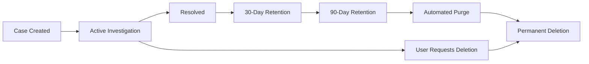
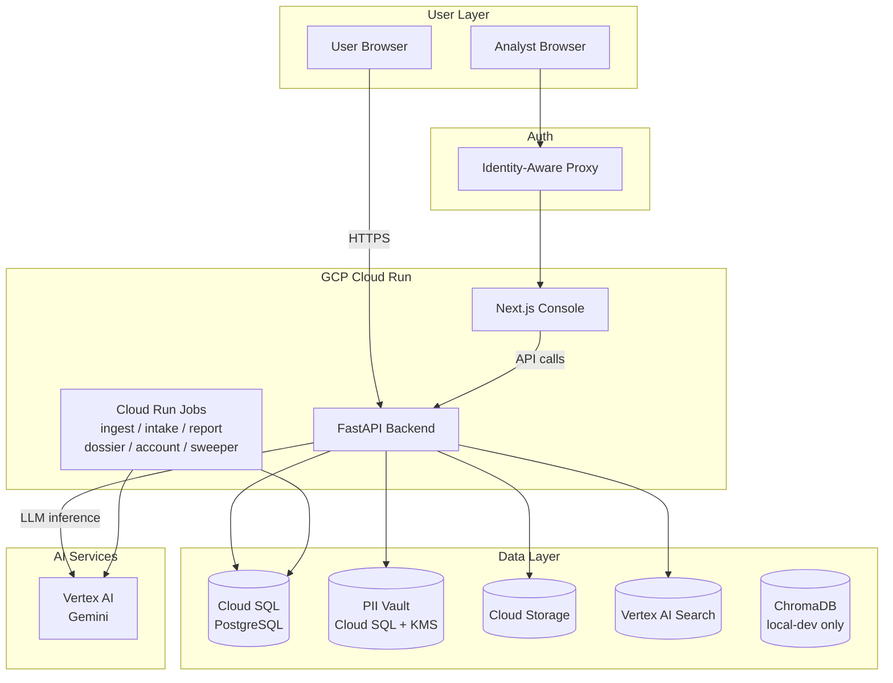

# Product Requirements Document: i4g Production System

> **Note**: This file is a copy of the production PRD made available in the `planning/` workspace for planning and cross-team reference. The canonical production PRD remains in `core/docs/prd_production.md`.

# Product Requirements Document: i4g Production System

> **Document Version**: 2.0
> **Last Updated**: February 8, 2026
> **Owner**: Jerry Soung
> **Status**: Production — Active

---

## Executive Summary

**i4g (Intelligence for Good)** is a production fraud-intelligence platform deployed on Google Cloud Platform that helps scam victims document fraud and generates law enforcement reports. The system is live with a **Next.js analyst console** (9 pages connected to a FastAPI backend with 13 API routers), **Vertex AI / Gemini** for LLM inference, **Vertex AI Search** for hybrid retrieval, **Cloud SQL PostgreSQL** for structured data, and an isolated **PII Vault** with KMS encryption. Six Cloud Run Jobs handle background processing (ingest, intake, report, dossier, account-list, classification sweeper).

**Deployment**: GCP Cloud Run (serverless, auto-scaling) — `i4g-dev` and `i4g-prod` projects
**Authentication**: Identity-Aware Proxy (IAP) + API key auth
**Success Metric**: Analyst console operational, dossier/LEO report pipeline live, fraud taxonomy with FTC categories

**Frontend Note**: The **Next.js analyst console** is the sole production UI. The legacy Streamlit operations console was retired during the Phase 1 CTO-Ready consolidation sprint. All analyst workflows, case review, and report generation flow through the Next.js console backed by the FastAPI API.

---

## Problem Statement

**Current State (Production — February 2026)**:
- ✅ FastAPI backend with 13 API routers deployed on Cloud Run
- ✅ Next.js analyst console (9 pages) connected to live backend
- ✅ Cloud SQL PostgreSQL (production) + isolated PII Vault with KMS encryption
- ✅ Vertex AI / Gemini for LLM inference; Vertex AI Search for hybrid retrieval
- ✅ Six Cloud Run Jobs: ingest, intake, report, dossier, account-list, classification sweeper
- ✅ Fraud taxonomy with FTC categories and campaign governance
- ✅ Dossier / LEO report generation pipeline with digital signatures
- ✅ IAP + API key authentication; row-level access control
- ✅ Structured logging via Cloud Logging; Cloud Monitoring alerts

**Remaining Gaps (tracked for future sprints)**:
- ⏳ **Compliance**: FERPA/GDPR data-retention automation partially implemented
- ⏳ **Mobile clients**: API is mobile-ready (`/api/v1`), native apps not yet started
- ⏳ **Advanced analytics dashboard**: Basic metrics only; richer BI planned

---

## Goals & Success Criteria

### Phase 1: MVP (Weeks 1-4)
**Goal**: Secure, monitored API deployed to GCP Cloud Run

| Metric | Target | Measurement |
|--------|--------|-------------|
| System Uptime | 95%+ | Cloud Monitoring |
| PII Leakage | 0 incidents | Audit logs |
| Authentication | 100% OAuth | No anonymous access |
| Test Coverage | ≥80% | pytest-cov |
| Infrastructure Cost | $0 | GCP billing dashboard |
| API Versioning | `/api/v1` baseline | OpenAPI spec committed |

### Phase 2: Beta Launch (Weeks 5-8)
**Goal**: 3 volunteer analysts onboarded and processing real cases

| Metric | Target | Measurement |
|--------|--------|-------------|
| Active Analysts | 3+ | Cloud SQL `analysts` table |
| Cases Processed | 50+ | Cloud SQL `cases` table |
| False Positive Rate | <20% | Manual review |
| Analyst NPS | ≥8/10 | Post-beta survey |
| Mobile Readiness Checklist | Drafted | Architecture review |

### Phase 3: Partnership Readiness (Months 3-6)
**Goal**: Pitch-ready for university and AARP partnerships

| Metric | Target | Measurement |
|--------|--------|-------------|
| Active Analysts | 12+ | Cloud SQL |
| Cases Processed | 200+ | Analytics dashboard |
| LEO Reports Generated | 10+ | PDF exports |
| Funding Secured | $10K+ | Grant applications |
| Mobile SDK Backlog | Prioritized | Product board |

---

## User Personas

### 1. **Scam User** (Primary End User)
- **Demographics**: 65+ years old, limited technical literacy
- **Pain Points**:
  - Overwhelmed by evidence collection (emails, screenshots, receipts)
  - Fear of sharing personal information online
  - Difficulty articulating fraud to law enforcement
- **Goals**:
  - Simple upload process (drag-and-drop)
  - Confidence that PII is protected
  - Professional police report for filing

**User Journey**:
1. User visits `i4g.org/report`
2. Uploads evidence (emails, screenshots, bank statements)
3. System automatically extracts PII and tokenizes
4. Receives confirmation email with case ID
5. Analyst reviews and approves case (1-3 days)
6. User receives PDF police report via secure link

---

### 2. **Volunteer Analyst** (Secondary User)
- **Demographics**: Graduate students (criminology, data science), retired professionals
- **Skills**: Basic investigative skills, detail-oriented, empathetic
- **Pain Points**:
  - Needs FERPA training (if university-affiliated)
  - Limited time (10 hours/week)
  - Wants to help but fears legal liability
- **Goals**:
  - Clear case review workflow
  - No exposure to raw PII (tokenized display)
  - Recognition for volunteer work (letters of recommendation)

**User Journey**:
1. Analyst signs in with Google (OAuth)
2. Sees dashboard with assigned cases
3. Reviews evidence (PII masked as `███████`)
4. Adds notes, marks scam type
5. Approves case → system generates LEO report
6. Tracks impact metrics (cases closed, $ recovered)

---

### 3. **Law Enforcement Officer** (Tertiary User)
- **Demographics**: Detectives in financial crimes units
- **Pain Points**:
  - Receives poorly documented user reports
  - Lacks technical expertise to analyze crypto transactions
  - Case backlog (hundreds of open fraud cases)
- **Goals**:
  - Standardized report format (court-admissible)
  - Digital evidence chain of custody
  - Batch export for multi-user cases

**User Journey**:
1. User brings i4g-generated report to police station
2. LEO validates report authenticity (digital signature)
3. Accesses evidence files via secure portal (with subpoena if needed)
4. Downloads batch export for organized crime investigation

---

## Functional Requirements

### FR-1: PII Tokenization (P0 - Critical Path)
**Requirement**: All personally identifiable information (PII) must be tokenized immediately upon upload and stored separately from case data.

**Acceptance Criteria**:
- [ ] System detects PII using regex patterns (SSN, email, phone, credit card, address, DOB)
- [ ] LLM-assisted PII extraction for contextual patterns (e.g., "my social security number is...")
- [ ] PII encrypted with AES-256-GCM before storage in PII Vault database
- [ ] Case data contains only tokens (e.g., `<PII:SSN:7a8f2e>`)
- [ ] Analysts see masked PII (e.g., `███████`) in dashboard
- [ ] LEO reports reconstruct real PII only with user consent

**Implementation Notes**:
```python
# Example tokenization flow
text = "My SSN is 123-45-6789"
pii_detector = PIIDetector()
tokens = pii_detector.tokenize(text)
# Returns: {"ssn": "<PII:SSN:7a8f2e>"}

# Stored in Cloud SQL cases table
{"description": "My SSN is <PII:SSN:7a8f2e>"}

# Stored in PII Vault (encrypted)
{"token": "7a8f2e", "value": "AES-256-GCM encrypted"}
```

**Dependencies**: None (foundational requirement)
**Effort**: 6 hours (regex patterns + encryption layer)

---

### FR-2: OAuth 2.0 Authentication (P0 - Critical Path)
**Requirement**: Only approved analysts can access the dashboard and case data.

**Acceptance Criteria**:
- [ ] "Sign in with Google" button on dashboard homepage
- [ ] OAuth 2.0 flow using Google Identity Platform
- [ ] JWT token stored in session (expires in 1 hour)
- [ ] Row-level security enforces `cases` access based on `assigned_to` field
- [ ] Admin role can approve new analysts via `/api/analysts/{uid}/approve` endpoint

**User Roles**:
| Role | Permissions |
|------|-------------|
| `user` | View/edit own case only |
| `analyst` | View assigned cases, add notes |
| `admin` | View all cases, manage analysts |
| `leo` | Download reports with subpoena |

**Implementation Notes**:
- Prefer OAuth PKCE flow and refresh tokens to support future mobile clients.
- Store refresh tokens in database with short TTL and rotation on every use.
```python
from fastapi import Depends, HTTPException
from fastapi.security import OAuth2PasswordBearer

oauth2_scheme = OAuth2PasswordBearer(tokenUrl="token")

async def get_current_user(token: str = Depends(oauth2_scheme)):
    user = verify_jwt(token)
    if not user:
        raise HTTPException(status_code=401)
    return user
```

**Dependencies**: FR-1 (PII vault must be isolated)
**Effort**: 4 hours (Google OAuth + database RBAC)

---

### FR-3: Cloud Run Deployment (P0 - Critical Path)
**Requirement**: Deploy FastAPI backend and Cloud Run Jobs to GCP Cloud Run for production access.

**Acceptance Criteria**:
- [ ] Dockerfile builds successfully (`docker build -t i4g-api .`)
- [ ] Image pushed to Google Container Registry (`gcr.io/i4g-prod/api:latest`)
- [ ] Cloud Run service deployed with HTTPS endpoint (`https://api.i4g.org`)
- [ ] Auto-scaling: 0 → 10 instances based on traffic
- [ ] Environment variables (API keys, DB connection) stored in Secret Manager
- [ ] Health check endpoint (`/api/health`) returns 200 OK

**GCP Cloud Run Configuration**:
- Auto-scaling: 0 → 10 instances
- HTTPS with custom domain
- Secret Manager for environment variables

**Implementation Notes**:
```dockerfile
FROM python:3.11-slim
WORKDIR /app
COPY requirements.txt .
RUN pip install --no-cache-dir -r requirements.txt
COPY src/ .
CMD ["uvicorn", "i4g.api.app:app", "--host", "0.0.0.0", "--port", "8080"]
```

```bash
gcloud run deploy i4g-api \
  --image gcr.io/i4g-prod/api:latest \
  --region us-central1 \
  --allow-unauthenticated \
  --max-instances 10 \
  --memory 1Gi
```

**Dependencies**: FR-1, FR-2 (security must be in place)
**Effort**: 3 hours (Dockerfile + gcloud deployment)

---

### FR-4: Structured Logging & Monitoring (P0 - Must Have)
**Requirement**: Track system health, errors, and security events.

**Acceptance Criteria**:
- [ ] All logs in JSON format with correlation IDs
- [ ] Log levels: DEBUG, INFO, WARNING, ERROR, CRITICAL
- [ ] Cloud Logging integration (automatically collected from Cloud Run)
- [ ] Custom metrics: `/pii_vault` access count, classification accuracy, API latency
- [ ] Alerting policies: Error rate >5% for 5 minutes, latency p95 >2 seconds

**Log Schema**:
```json
{
  "timestamp": "2025-10-30T12:00:00Z",
  "severity": "INFO",
  "correlation_id": "uuid-v4",
  "user_id": "analyst_uid_123",
  "action": "case_approved",
  "case_id": "case_uuid",
  "metadata": {
    "classification": "Romance Scam",
    "confidence": 0.92
  }
}
```

**Monitoring Dashboard**:
- System uptime (99%+ target)
- Request rate (requests/second)
- Error rate (5xx responses)
- PII vault access (detect anomalies)

**Dependencies**: FR-3 (Cloud Run must be deployed)
**Effort**: 3 hours (structured logging + Cloud Monitoring setup)

---

### FR-5: Analyst Dashboard (P1 - High Priority)
**Requirement**: Next.js analyst console for case review with PII masking.

**Acceptance Criteria**:
- [x] IAP-authenticated login (Identity-Aware Proxy)
- [x] Case list view (sortable by date, status, scam type)
- [x] Case detail view with evidence thumbnails
- [x] PII masked as `███████` (tooltip shows token ID for debugging)
- [x] Notes section (markdown support)
- [x] Search with saved-search CRUD and search history
- [x] Mobile-responsive design (works on tablets)

**UI Mockup** (text-based):
```
┌─────────────────────────────────────────┐
│ i4g Analyst Dashboard                   │
│ Logged in as: jane@university.edu       │
├─────────────────────────────────────────┤
│ Assigned Cases (12)                     │
│                                         │
│ ┌─────────────────────────────────────┐ │
│ │ Case \#1234 - Romance Scam          │ │
│ │ User: ███████ (@gmail.com)        │ │
│ │ Amount Lost: $10,000                │ │
│ │ Status: Pending Review              │ │
│ │ [View Details] [Approve]            │ │
│ └─────────────────────────────────────┘ │
│                                         │
│ ┌─────────────────────────────────────┐ │
│ │ Case \#1235 - Crypto Scam           │ │
│ │ User: ███████ (@outlook.com)      │ │
│ │ Amount Lost: $5,000                 │ │
│ │ Status: In Progress                 │ │
│ │ [View Details]                      │ │
│ └─────────────────────────────────────┘ │
└─────────────────────────────────────────┘
```

**Dependencies**: FR-1 (PII tokenization), FR-2 (OAuth/IAP)
**Effort**: Delivered — Next.js console with 9 pages, Turborepo monorepo

---

### FR-6: Automated Testing (P1 - High Priority)
**Requirement**: Comprehensive test suite to prevent regressions.

**Acceptance Criteria**:
- [ ] Unit test coverage ≥80%
- [ ] Integration tests for critical paths (upload → classify → review → report)
- [ ] E2E tests using pytest-playwright (optional)
- [ ] Tests run in GitHub Actions on every PR
- [ ] Pre-commit hooks for linting (black, isort, mypy)

**Test Structure**:
```
tests/
├── unit/
│   ├── test_pii_tokenizer.py       # FR-1 tests
│   ├── test_auth.py                # FR-2 tests
│   ├── test_classification.py      # RAG pipeline tests
│   └── test_report_generation.py   # PDF export tests
├── integration/
│   ├── test_case_workflow.py       # Upload → classify → approve
│   └── test_db_operations.py
└── e2e/
    └── test_dashboard_flow.py      # Login → review case → approve
```

**CI Pipeline** (GitHub Actions):
```yaml
name: CI
on: [push, pull_request]
jobs:
  test:
    runs-on: ubuntu-latest
    steps:
      - uses: actions/checkout@v3
      - uses: actions/setup-python@v4
        with:
          python-version: '3.11'
      - run: pip install -e ".[dev]"
      - run: pytest tests/ --cov=src/i4g --cov-report=xml
      - run: black --check src/ tests/
      - run: mypy src/
```

**Dependencies**: None (can be developed in parallel)
**Effort**: 6 hours (integration tests + CI setup)

---

### FR-7: LEO Report Generation (P2 - Nice to Have)
**Requirement**: Generate PDF reports suitable for law enforcement submission.

**Acceptance Criteria**:
- [ ] PDF format (replacing current .docx)
- [ ] Standardized template: Header, user info, scammer info, timeline, evidence links
- [ ] Digital signature (hash + timestamp for authenticity)
- [ ] Batch export (multiple cases for organized crime investigation)
- [ ] Downloadable from `/api/cases/{case_id}/report.pdf`

**Report Template** (text preview):
```
────────────────────────────────────────
       i4g LAW ENFORCEMENT REPORT
────────────────────────────────────────
Case ID: 1234
Generated: 2025-10-30 12:00:00 UTC
Analyst: Jane Doe (jane@university.edu)

VICTIM INFORMATION:
  Name: [REDACTED - See PII Vault]
  Email: user@example.com
  Phone: [REDACTED]

SCAM CLASSIFICATION:
  Type: Romance Scam
  Confidence: 92%
  AI Model: Vertex AI / Gemini

FINANCIAL LOSS:
  Amount: $10,000 USD
  Transaction Method: Wire transfer
  Recipient: [Bank details in evidence]

TIMELINE:
  2025-09-15: First contact on dating app
  2025-09-20: Scammer requests financial help
  2025-09-25: User sends $10,000
  2025-09-30: Scammer stops responding

EVIDENCE FILES:
  - chat_transcript.pdf (Cloud Storage: gs://...)
  - wire_transfer_receipt.pdf
  - dating_profile_screenshot.png

ANALYST NOTES:
  Verified wire transfer receipt. Scammer used
  fake profile with stolen photos. Recommend
  contacting bank for transaction reversal.

────────────────────────────────────────
Digital Signature: SHA-256 hash
Timestamp: 2025-10-30T12:00:00Z
────────────────────────────────────────
```

**Dependencies**: FR-1 (PII vault for user details), FR-5 (analyst approval)
**Effort**: 4 hours (PDF generation + template design)

---

### FR-8: Mobile API Readiness (P1 - High Priority)
**Requirement**: Provide a versioned, well-documented public API that future iOS/Android clients can consume without breaking changes.

**Acceptance Criteria**:
- [ ] All external endpoints namespaced under `/api/v1/...` with consistent request/response models.
- [ ] OpenAPI specification exported on every build and stored at `docs/openapi/i4g-v1.yaml`.
- [ ] Automated contract tests fail if responses drift from the spec.
- [ ] OAuth flow exposes PKCE support and refresh-token rotation suitable for mobile native clients.
- [ ] Client SDK scaffolding generated via `openapi-generator` for TypeScript and Swift; artifacts stored in `/sdk/`.
- [ ] Deprecation policy documented (minimum 90-day notice before breaking change).

**Implementation Notes**:
- Add `X-Client-Version` header to capture analytics and enable future feature gating.
- Annotate FastAPI routes with `response_model` to keep the OpenAPI spec authoritative.
- Consider rate limiting based on OAuth client ID once mobile apps are launched.

**Dependencies**: FR-2 (OAuth), FR-3 (Cloud Run), FR-6 (Automated testing)
**Effort**: 5 hours (router refactor, documentation, automation)

---

### FR-9: Data Retention & Compliance (P1 - High Priority)
**Requirement**: Comply with FERPA, GDPR, and state data breach laws.

**Acceptance Criteria**:
- [ ] Data retention policy: 90 days post-resolution (configurable)
- [ ] Automated purge job (Cloud Scheduler runs daily)
- [ ] GDPR-compliant data export (`/api/cases/{case_id}/export` returns JSON)
- [ ] GDPR-compliant deletion (`DELETE /api/cases/{case_id}` hard deletes from Cloud SQL + PII vault)
- [ ] Incident response plan documented (see COMPLIANCE.md)
- [ ] FERPA training materials for university-affiliated analysts

**Data Lifecycle**:


**Purge Job** (Cloud Scheduler):
```python
@app.post("/cron/purge-expired-cases")
async def purge_expired_cases():
    cutoff = datetime.now() - timedelta(days=90)
    expired = db.collection("cases").where(
        "resolved_at", "<", cutoff
    ).stream()

    for case in expired:
        # 1. Delete PII vault entries
        await purge_pii_for_case(case.id)
        # 2. Delete case
        await case.reference.delete()
        # 3. Log action
        logger.info(f"Purged case {case.id}")
```

**Dependencies**: FR-3 (Cloud Run for cron jobs)
**Effort**: 4 hours (purge job + GDPR endpoints)

---

### FR-10: Background Task Queue (P2 - Nice to Have)
**Requirement**: Offload long-running or asynchronous work (report generation, bulk ingestion, future mobile push notifications) to a queue-backed worker so API responses stay fast.

**Acceptance Criteria**:
- [ ] Worker service wraps `i4g.worker.tasks` with queue-backed execution (e.g., Celery + Redis or Arq).
- [ ] `/api/health` includes worker heartbeat information.
- [ ] Retry policy with exponential backoff (max 5 attempts) and dead-letter logging.
- [ ] Configuration flag allows in-process execution for local development and tests.
- [ ] Documentation outlines how mobile devices will receive async status updates (polling vs. push).

**Implementation Notes**:
- Start with Redis (Cloud Memorystore) or Cloud Tasks; fall back to `asyncio` executor during MVP.
- Emit structured logs for enqueue/dequeue actions for easier troubleshooting.
- Define topic names such as `case.accepted` and `report.ready` to seed a future event bus.

**Dependencies**: FR-3 (deployment), FR-6 (contract tests), FR-7 (report generation)
**Effort**: 6 hours (queue integration + monitoring)

---

## Non-Functional Requirements

### NFR-1: Performance
- **API Response Time**: p95 < 2 seconds (excluding LLM inference)
- **LLM Classification**: < 5 seconds per case
- **Dashboard Load Time**: < 3 seconds on 4G connection
- **Concurrent Users**: Support 20 simultaneous analysts

### NFR-2: Scalability
- **Cost Monitoring**: GCP billing alerts configured per project
- **Horizontal Scaling**: Cloud Run auto-scales 0 → 10 instances
- **Database**: Cloud SQL PostgreSQL with connection pooling via Auth Proxy

### NFR-3: Security
- **Encryption at Rest**: AES-256-GCM for PII vault
- **Encryption in Transit**: TLS 1.3 for all API calls
- **Authentication**: OAuth 2.0 (no password storage)
- **Authorization**: Database RBAC (row-level security)
- **Audit Logging**: All `/pii_vault` access logged

### NFR-4: Reliability
- **Uptime Target**: 95%+ (acceptable for non-profit)
- **Recovery Time Objective (RTO)**: 4 hours (restore from daily backup)
- **Recovery Point Objective (RPO)**: 24 hours (daily Cloud SQL backups)

---

## MVP Definition (40 Hours Over 4 Weeks)

**Minimum Viable Product** includes:

✅ **Security**:
- FR-1: PII tokenization
- FR-2: OAuth 2.0 authentication
- FR-9: Basic data retention (90 days)

✅ **Infrastructure**:
- FR-3: Cloud Run deployment
- FR-4: Structured logging + monitoring
- FR-8: Mobile API readiness (`/api/v1` + OpenAPI spec)

✅ **User Experience**:
- FR-5: Analyst dashboard with PII masking

✅ **Quality**:
- FR-6: 80% test coverage + CI/CD

**Explicitly Out of Scope for MVP**:
- ❌ PDF report generation (FR-7) - can use current .docx approach
- ❌ Mobile app - web-only for MVP
- ❌ Multi-language support - English only
- ❌ Background task queue (FR-10) - synchronous execution acceptable
- ❌ Advanced analytics dashboard - basic metrics only

---

## Technical Architecture

### High-Level Diagram



### Technology Stack

| Component | Technology | Rationale |
|-----------|-----------|-----------|
| **Backend** | FastAPI 0.104+ (13 routers) | Async, type hints, OpenAPI docs |
| **Frontend** | Next.js 14+ (React, TypeScript) | Production React UI, Turborepo monorepo |
| **Database** | Cloud SQL PostgreSQL | Managed, relational, Cloud SQL Auth Proxy |
| **PII Vault** | Cloud SQL PostgreSQL (isolated) | KMS-encrypted, separate instance |
| **Vector DB** | Vertex AI Search (cloud) / ChromaDB (local) | Hybrid search with SQL dual-write |
| **LLM** | Vertex AI Gemini (cloud) / Ollama (local) | Managed, scalable; Ollama for laptop dev |
| **Hosting** | Cloud Run (services + jobs) | Serverless, auto-scaling |
| **Auth** | IAP + API key auth | Identity-Aware Proxy for console; API keys for services |
| **Monitoring** | Cloud Logging + Monitoring | Native GCP integration |
| **CI/CD** | GitHub Actions | Automated build, test, deploy |

---

## Deployment Architecture

### GCP Deployment Services

**Services Used (i4g-dev / i4g-prod)**:
| Service | Purpose | Notes |
|---------|---------|-------|
| Cloud Run (services) | FastAPI backend, Next.js console | Auto-scaling, HTTPS |
| Cloud Run (jobs) | ingest, intake, report, dossier, account-list, classification sweeper | Scheduled + on-demand |
| Cloud SQL PostgreSQL | Primary database | Cloud SQL Auth Proxy |
| Cloud SQL PostgreSQL (PII Vault) | Isolated PII storage | KMS encryption, separate instance |
| Vertex AI | Gemini LLM inference | Pay-per-use |
| Vertex AI Search | Hybrid vector retrieval | Managed search |
| Cloud Storage | Evidence files, report PDFs | Standard storage |
| Secret Manager | API keys, DB credentials | Versioned secrets |
| Cloud Logging + Monitoring | Observability, alerting | Structured JSON logs |
| Artifact Registry | Container images | Docker image hosting |
| Identity-Aware Proxy | Console authentication | Google-managed auth |

---

### Database Schema

```sql
-- Cloud SQL PostgreSQL (primary database)
cases              -- case_id, created_at, user_email, title, description (PII-tokenized),
                   -- classification, confidence, status, assigned_to, evidence_files
case_notes         -- note_id, case_id, author, text, created_at
reviews            -- review_id, case_id, reviewer, decision, created_at
saved_searches     -- id, user_id, name, query_json, created_at
search_history     -- id, user_id, query_text, executed_at
audit_log          -- id, user_id, action, resource, metadata, created_at
campaigns          -- campaign_id, name, taxonomy_code, ftc_category, status
accounts           -- account_id, email, role, approved, last_login

-- Cloud SQL PostgreSQL (PII Vault — isolated instance, KMS-encrypted)
pii_tokens         -- token_id, case_id, pii_type, encrypted_value, key_version, created_at
```

---

## Risk Management

### Technical Risks

| Risk | Likelihood | Impact | Mitigation |
|------|------------|--------|------------|
| **Free tier exceeded** | Medium | High | Weekly quota monitoring + billing alerts |
| **PII data breach** | Low | Critical | Security audits every 2 weeks + penetration testing |
| **Ollama downtime** | Medium | Medium | Health checks + automatic retry logic |
| **Database connection limits** | Low | Medium | Implement caching layer (Redis) if needed |

### Operational Risks

| Risk | Likelihood | Impact | Mitigation |
|------|------------|--------|------------|
| **Volunteer burnout** | High | High | Strict 10-hour/week limit + clear documentation |
| **No analyst signups** | Medium | High | University partnerships + AARP outreach |
| **Legal liability** | Low | Critical | Terms of Service + disclaimer (not legal advice) |
| **Funding gap** | Medium | Medium | Grant applications + sponsorship pitches |

---

## Compliance & Legal

### FERPA (University Partnerships)
- All university-affiliated analysts must complete FERPA training
- Data Use Agreement (DUA) signed annually
- No educational records stored (only user-submitted evidence)

### GDPR/CCPA (Data Privacy)
- Data export: `/api/cases/{case_id}/export` (JSON format)
- Data deletion: `DELETE /api/cases/{case_id}` (hard delete)
- Consent tracking: Users opt-in to data processing

### Data Breach Laws (50 States)
- Incident response plan (detect, contain, notify within 72 hours)
- User notification template prepared
- Law enforcement contact (local FBI Cyber Division)

---

## Funding & Sustainability

### Phase 1: Bootstrap (Months 1-3)
- **Budget**: $0
- **Strategy**: GCP free tier + volunteer labor
- **Goal**: Prove concept with 3 beta analysts

### Phase 2: Seed Funding (Months 4-6)
- **Target**: $10K
- **Sources**:
  - Google for Nonprofits (apply after 501(c)(3) status)
  - AWS Activate ($5K credits)
  - University research grants
- **Goal**: Scale to 12 analysts + marketing materials

### Phase 3: Sustainability (Months 7-12)
- **Target**: $50K/year
- **Sources**:
  - NSF SBIR grant (Small Business Innovation Research)
  - AARP sponsorship
  - Corporate partnerships (Google.org, Microsoft Philanthropies)
- **Goal**: Part-time project manager + legal advisor

---

## Recommended Next Steps

### Completed (as of February 2026)
1. ✅ Create production PRD (this document)
2. ✅ Create Technical Design Document (TDD)
3. ✅ Update ROADMAP.md with task breakdown
4. ✅ Set up GCP projects (`i4g-dev`, `i4g-prod`)
5. ✅ Implement PII tokenization module (FR-1) — PII Vault with KMS
6. ✅ Add authentication (FR-2) — IAP + API key auth
7. ✅ Set up database RBAC/RLS — Cloud SQL PostgreSQL
8. ✅ Dockerize FastAPI application (FR-3) — multi-image builds via `scripts/build_image.sh`
9. ✅ Deploy to Cloud Run (FR-3) — services + 6 Cloud Run Jobs
10. ✅ Set up CI/CD pipeline (GitHub Actions)
11. ✅ Configure monitoring & alerts (FR-4) — Cloud Logging + Monitoring
12. ✅ Build Next.js analyst console (FR-5) — 9 pages, Turborepo monorepo
13. ✅ Write unit + integration tests (FR-6)
14. ✅ LEO report generation pipeline (FR-7) — digital signatures, dossier generation
15. ✅ Fraud taxonomy with FTC categories + campaign governance
16. ✅ Hybrid search — SQL + Vertex AI Search dual-write
17. ✅ Retire Streamlit console (CTO-Ready consolidation sprint Phase 1)
18. ✅ Deploy to production

### Current Sprint (CTO-Ready Consolidation)
19. ⏳ Documentation consolidation and accuracy pass
20. ⏳ Dead-code removal and repo hygiene
21. ⏳ Settings/env-var audit and test coverage

### Next (Production Hardening v2)
22. ⚪ Data retention automation (FR-9) — scheduled purge jobs
23. ⚪ Advanced analytics dashboard
24. ⚪ Partner integrations (university, AARP)
25. ⚪ Mobile SDK scaffolding (FR-8)

---

## Appendix A: Glossary

- **PII**: Personally Identifiable Information (SSN, bank account, full name, address)
- **Tokenization**: Replacing PII with unique identifiers (e.g., `<PII:SSN:7a8f2e>`)
- **RAG**: Retrieval-Augmented Generation (LLM + knowledge base)
- **LEO**: Law Enforcement Officer
- **FERPA**: Family Educational Rights and Privacy Act (protects student records)
- **GDPR**: General Data Protection Regulation (EU data privacy law)
- **CCPA**: California Consumer Privacy Act (California data privacy law)

---

## Appendix B: Contact Information

- Maintainer: Jerry Soung
- Email: jerry.soung@gmail.com
- GitHub: https://github.com/jsoung/i4g
- Documentation: https://github.com/jsoung/i4g/tree/main/docs

---

**Document Version History**:
- **v1.0** (2025-10-30): Initial production PRD created by Jerry Soung
- **v2.0** (2026-02-08): Updated to reflect production state — Next.js console, Vertex AI, Cloud SQL, PII Vault, 6 Cloud Run Jobs, IAP auth, fraud taxonomy. Retired Streamlit references.

**Next Review**: 2026-03-08 (monthly review cadence)

---

**Legal Disclaimer**: This document is for planning purposes only and does not constitute legal advice. Consult a licensed attorney for compliance questions.
