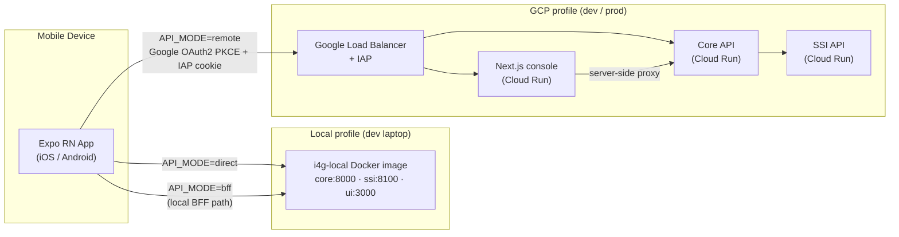
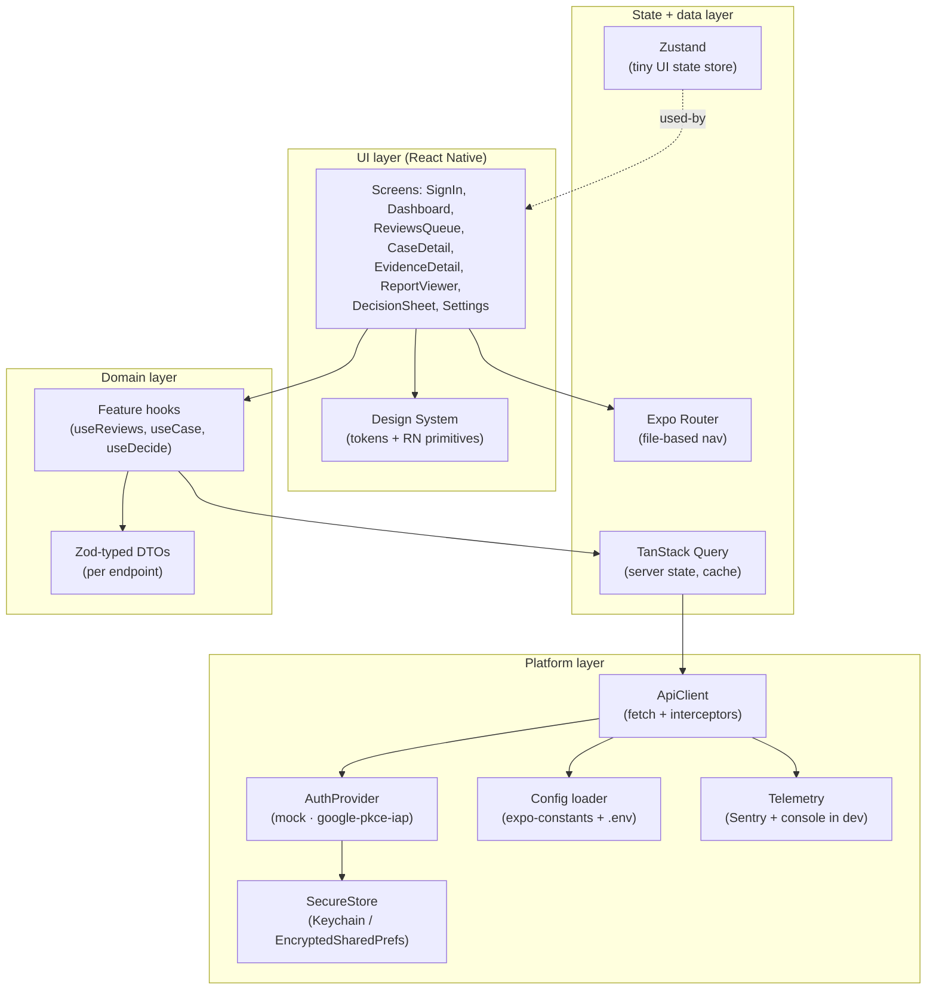
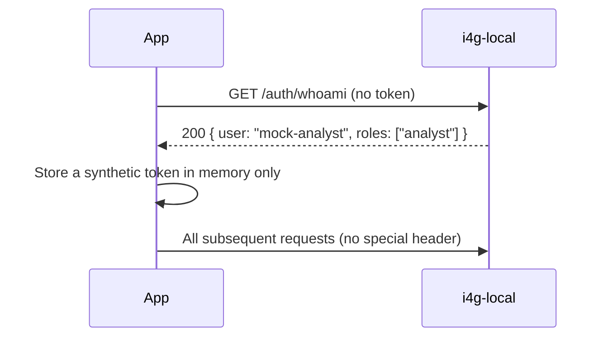
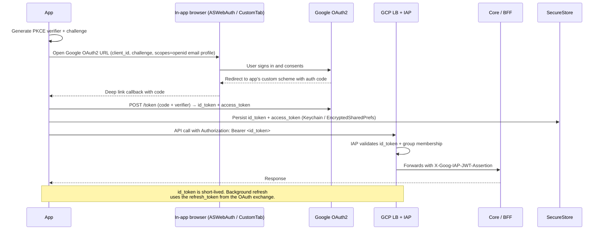
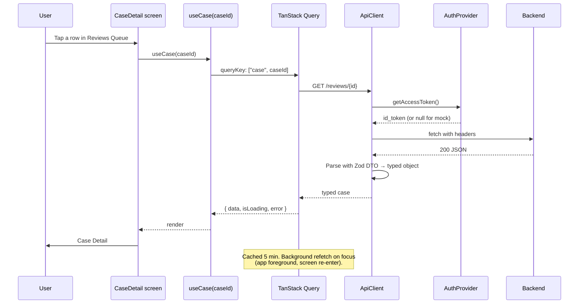
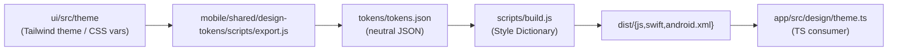

# Architecture — I4G Mobile Prototype

> **Status:** Draft v1.0
> **Scope:** How the mobile client fits into the I4G platform across local, dev, and prod profiles.
> **Companion docs:** [`core/docs/design/architecture.md`](../../../core/docs/design/architecture.md)
> (platform architecture) and [`tdd.md`](./tdd.md) (code-level design).

## 1. One-paragraph summary

The mobile app is a thin React Native client that consumes the **same HTTPS contract** the web console
consumes. It supports three runtime profiles — `local`, `dev`, `prod` — selected at app launch from an
env file. In `local` it talks to the `i4g-local` all-in-one Docker image with mock identity. In `dev`
and `prod` it talks to the Cloud Run services behind the Google Load Balancer with IAP, authenticating
via Google OAuth2 PKCE through `expo-auth-session`. It introduces **no new backend endpoints** and
**no new trust boundaries**.

## 2. System context



**Key property:** the app's HTTP stack doesn't care which profile it's in. A single `ApiClient` with
a base URL and an auth interceptor handles all three. Only the `AuthProvider` and base URL change.

## 3. Runtime profiles

| Profile        | `EXPO_PUBLIC_API_MODE` | `EXPO_PUBLIC_AUTH_PROVIDER` | Base URL                              | Identity                    | Notes                                                                |
| -------------- | ---------------------- | --------------------------- | ------------------------------------- | --------------------------- | -------------------------------------------------------------------- |
| `local-direct` | `direct`               | `mock`                      | `http://<host-lan-ip>:8000`           | Mock (local-aio's built-in) | **Default for novice dev.** Simplest; no BFF to run separately.      |
| `local-bff`    | `bff`                  | `mock`                      | `http://<host-lan-ip>:3000/api`       | Mock                        | Exercises the same proxy the web UI uses. Useful for parity testing. |
| `dev`          | `remote`               | `google-pkce-iap`           | `https://dev.intelligenceforgood.org` | Google OAuth2 → IAP cookie  | Prod-like. Requires Google Workspace membership.                     |
| `prod`         | `remote`               | `google-pkce-iap`           | `https://app.intelligenceforgood.org` | Google OAuth2 → IAP cookie  | Only used once the prototype is accepted.                            |

`<host-lan-ip>` is the dev laptop's LAN IP (e.g., `192.168.1.42`) — required so a physical phone on
the same Wi-Fi can reach the laptop. The developer guide explains how to find it.

The **only code that branches** on profile is:

- `ApiClient.create()` — picks base URL and auth interceptor.
- `AuthProvider` selection — `mock` vs `google-pkce-iap`.
- Settings screen — reveals/hides the env switcher in dev builds.

Every other module treats HTTP responses as the contract. This is the primary lever for "works on
laptop → works on GCP with only config changes."

## 4. Component view (mobile app internals)



Each layer has **one reason to change**:

- UI: tokens or screen layout changes.
- State: caching / navigation strategy.
- Domain: a new endpoint or DTO shape.
- Platform: a new profile or a new auth provider.

This is the boundary most likely to get sloppy first; the TDD calls it out explicitly.

## 5. Auth flows

### 5.1 `mock` (local)



`mock` means "the backend trusts the caller because the backend is running in local-aio with identity
disabled." The app doesn't send credentials. It still fetches `/auth/whoami` on startup to populate
the user object used by the UI.

### 5.2 `google-pkce-iap` (dev / prod)



**Key details for the prototype:**

- We use the Google OAuth2 client configured for the web console; we add the mobile's custom scheme
  (`com.intelligenceforgood.i4g://oauth`) as an authorized redirect URI. This requires one change in
  the GCP console, documented in the developer guide.
- IAP accepts Google-issued `id_token`s on `Authorization: Bearer` when configured for
  `programmatic access`. This is already enabled for the web proxy's server-to-server calls; we
  reuse the same setting. If it turns out IAP requires an additional audience, we document the
  `gcloud iap` command to add the mobile client id.
- Secure storage uses `expo-secure-store`, which wraps Keychain (iOS) and EncryptedSharedPrefs
  (Android). Tokens never hit AsyncStorage or the JS console.

## 6. Data flow for a typical screen (Case Detail)



The approve/reject mutation follows the same spine but uses `useMutation` + an **optimistic update**
on the queue cache, then invalidates `["case", caseId]` and `["reviews-queue"]` on success.

## 7. Repo layout (relative to workspace root)

```
mobile/
  app/                         # Expo RN app (NEW — this prototype creates it)
    app.config.ts              # Expo config (merges .env per profile)
    package.json
    tsconfig.json
    babel.config.js
    app/                       # Expo Router routes — file-based nav
      _layout.tsx
      sign-in.tsx
      (tabs)/
        _layout.tsx            # bottom tab bar
        dashboard.tsx
        queue.tsx
        settings.tsx
      case/
        [id].tsx
        [id]/evidence/[eid].tsx
        [id]/report.tsx
    src/
      api/                     # ApiClient + endpoint modules
      auth/                    # AuthProvider implementations
      components/              # shared UI primitives
      design/                  # token-consuming theme wrappers
      features/                # one folder per feature (reviews, cases, reports…)
        reviews/
          hooks.ts
          types.ts
          queries.ts
      lib/                     # config, logger, error boundary
      telemetry/
    __tests__/                 # unit tests (Vitest/Jest)
    e2e/                       # Maestro flows
    .env.local.example
    .env.dev.example
    .env.prod.example
  shared/
    design-tokens/             # EXISTING — already scaffolded
  docs/                        # EXISTING stub — we'll fill after prototype
```

**Ejection-safety note:** We stay on the Managed workflow. The moment someone needs to edit
`Info.plist` or `build.gradle`, they use Expo's **config plugins** (declarative) rather than
ejecting. The developer guide includes a "when to use a config plugin" cheat sheet.

## 8. Design token pipeline



The TS output in `dist/` is what the RN app imports. Swift and Android XML outputs are built at the
same time so we're ready if/when we move a feature to native.

## 9. Non-functional requirements

| Concern                  | Requirement                                              | How we meet it                                                                                                    |
| ------------------------ | -------------------------------------------------------- | ----------------------------------------------------------------------------------------------------------------- |
| **Security**             | No PII on disk. Tokens in secure storage only.           | Redacted logger; `expo-secure-store` for tokens; no AsyncStorage writes of response bodies.                       |
| **Privacy**              | Mobile inherits backend PII guarantees.                  | We don't call any endpoint the web console doesn't; no decryption on device.                                      |
| **Audit**                | Every mutation is attributable to a user.                | `X-Client: i4g-mobile/<version>` + standard `Authorization` header. Backend audit already keys on identity.       |
| **Observability**        | Crashes + network failures are actionable.               | Sentry (opt-in via env var, disabled in `local`); error boundary per tab; request/response timing in dev console. |
| **Performance**          | <3 s cold start on a 2020 iPhone; <1 s list interactive. | No heavy startup imports; list is virtualized; images lazy-loaded.                                                |
| **Resilience**           | Graceful network drop.                                   | TanStack Query retry-with-backoff; offline banner; cached last-view.                                              |
| **Accessibility**        | Dynamic type, VoiceOver/TalkBack labels.                 | `accessibilityLabel` on interactive elements; respect system font scale.                                          |
| **Internationalization** | English-only for prototype; structure allows i18n later. | Strings in a single `i18n/en.ts`; no hardcoded strings in JSX.                                                    |

## 10. Alternatives considered (and rejected)

| Alternative                            | Why considered                             | Why rejected                                                                                                               |
| -------------------------------------- | ------------------------------------------ | -------------------------------------------------------------------------------------------------------------------------- |
| Native (Swift + Kotlin)                | Best-in-class UX; every enterprise has it. | Two codebases for a solo novice dev is prohibitive for a prototype.                                                        |
| Flutter                                | Excellent tooling, great perf.             | Dart is a third language. No skill reuse from `ui/`.                                                                       |
| PWA / responsive web                   | Zero new toolchain.                        | iOS PWA limits (push, auth cookies, home-screen behavior). Fails G5: doesn't teach a mobile methodology.                   |
| Capacitor wrapping the Next.js console | Reuses entire `ui/`.                       | Locks the mobile UX to web layouts; auth-cookie handoff from IAP to WebView is fragile; we don't learn mobile engineering. |
| Expo **Bare** workflow (from day one)  | Max flexibility.                           | Discards the #1 reason we picked Expo — insulating a novice from native build files. We keep Bare as the escape hatch.     |
| Push notifications from day one        | Core mobile value prop.                    | Requires APNs cert + FCM project + IAP-safe topic routing; too much provisioning for a prototype.                          |

## 11. Threats and how the architecture neutralizes them

1. **Prompt-injection / malicious content in case data** — mobile never interprets case text as code.
   Markdown is rendered with an allowlist renderer.
2. **TLS MITM** — `remote` profile uses HTTPS only. Certificate pinning is deferred to post-prototype
   (it's a config-plugin change, not a rewrite).
3. **Reverse engineering of client to find endpoints** — endpoints are the same IAP-protected ones
   the web uses. The mobile app gives no new attack surface.
4. **Token theft on a rooted device** — tokens are short-lived; `SecureStore` is the OS-level best
   practice. We document the residual risk and the post-prototype option (device-attestation via
   Play Integrity / App Attest) in the TDD.
5. **Accidental PII in crash reports** — Sentry is configured with a `beforeSend` scrubber that
   strips request bodies and a known list of PII fields; tests assert the scrubber is installed.

## 12. What changes when we go from prototype → production

Captured here so no one is surprised later:

- **Paid Apple Developer Program** ($99/yr) + **Google Play Console** ($25 one-time) for store
  distribution.
- **Config plugin** for certificate pinning.
- **App Attest / Play Integrity** for device attestation.
- **Push notification** plumbing (APNs cert + FCM + backend topic routing).
- **Dedicated OAuth client IDs per env** (today the prototype may reuse the web client).
- **Crashlytics or Sentry org** with retention policy + PII scrubber review by security.
- **A11y audit** and localization pass.
- **A proper release train** (semver + release notes + staged rollout).

## 13. Decision log

| ID   | Date       | Decision                             | Rationale                                                                         |
| ---- | ---------- | ------------------------------------ | --------------------------------------------------------------------------------- |
| D-01 | 2026-04-20 | Expo Managed RN                      | Fastest path for a novice solo dev.                                               |
| D-02 | 2026-04-20 | TanStack Query for server state      | De facto standard; matches likely future `ui/` direction.                         |
| D-03 | 2026-04-20 | Zustand for UI state                 | Tiny, no-Provider, composable. Easy to remove if we outgrow it.                   |
| D-04 | 2026-04-20 | Expo Router (file-based)             | Familiar to anyone who's seen Next.js; lowers the nav learning cliff.             |
| D-05 | 2026-04-20 | Zod DTOs at API boundary             | Runtime + compile-time type safety. Catches backend drift early.                  |
| D-06 | 2026-04-20 | Dev Client instead of Expo Go        | Lets us use config plugins + custom native modules without ejecting.              |
| D-07 | 2026-04-20 | Maestro for E2E                      | Best RN E2E story in 2026; YAML flows are readable by a novice.                   |
| D-08 | 2026-04-20 | Sentry (opt-in) for telemetry        | Cross-platform, free tier, good RN support. Firebase Crashlytics also acceptable. |
| D-09 | 2026-04-20 | No app-store submission in prototype | Saves money and gate-keeping; sideload + Expo Dev Client is enough.               |

---

Next: [tdd.md](./tdd.md) for code-level design, and [implementation-plan.md](./implementation-plan.md)
for sprint work.
