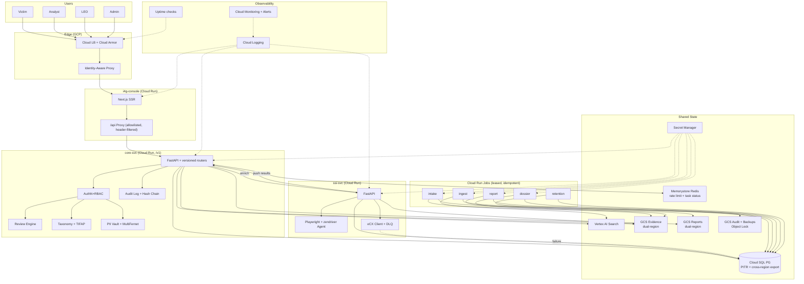

# I4G Platform — Super CxO Review

**Date:** 17 April 2026 · **Reviewer:** Super CxO (Opus 4.7 via GitHub Copilot)
**Scope:** 9 repos, multi-root workspace. Depth: ~2 weeks of immersion equivalent.
**Caveat:** Review is based on static analysis of code, config, docs, and change log. Runtime behavior, production metrics, and live user feedback were not directly observed. Findings flagged `[VERIFY]` need runtime confirmation; findings flagged `[AI-AUDIT]` are plausible failure modes of AI-generated code to investigate.

---

## Part 1 — Executive Summary

### Platform health scores

| Dimension                            | Score               | One-line justification                                                                                                                                                                                                                                                                        |
| ------------------------------------ | ------------------- | --------------------------------------------------------------------------------------------------------------------------------------------------------------------------------------------------------------------------------------------------------------------------------------------- |
| **1. Product & Strategy**            | **7 / 10**          | Nine coherent PRDs, clear mission, good persona model. Prioritization is muddled: 3 in-flight initiatives (entity-extraction-v2, fraud-taxonomy, engagements) competing for a tiny team.                                                                                                      |
| **2. Architecture & System Design**  | **6 / 10**          | Right-sized macro-architecture (Core + SSI + UI + infra). Undermined by several concrete defects: no API versioning, in-memory rate limit + task status on a multi-instance Cloud Run, `disable_auth` not env-gated, shared DB schema owned by two repos, no DR strategy for evidence in GCS. |
| **3. Code Quality & Implementation** | **6 / 10**          | Consistent style, strong typing, good use of Pydantic/TypeScript strict. Weaknesses: broad `except Exception` patterns, non-timing-safe API key compare, hand-written SDK types that will drift, many FK columns without indexes, test theater in unit tests.                                 |
| **4. Developer Experience**          | **7 / 10**          | Excellent Copilot workflow system, good shared docs, honest change log. Friction: three conda envs, heavy bootstrap, no Dockerized onboarding, CI auto-deploys to prod without staging approval.                                                                                              |
| **5. Design & Usability**            | **5 / 10** [VERIFY] | IA seems coherent from route map; however engagement cookie is not `HttpOnly`/`Secure`, accessibility was not verified in code, end-user docs for LEO and victim are stubs.                                                                                                                   |
| **6. Operational Readiness**         | **4 / 10**          | **Not production-ready.** No staging, no cross-region backup for evidence, sparse alerting, no DR runbook, no per-user rate limit, no SBOM/dependency scanning. Gemini API key migration still incomplete per change log.                                                                     |

**Overall:** **5.8 / 10** — A technically ambitious platform with genuine engineering discipline, standing on a pre-production operational foundation. It is roughly six to ten weeks of focused hardening away from defensible user-facing launch, and this review assumes that time is invested before onboarding real victims.

### Top 5 strengths to preserve and build on

1. **Mission-aligned, right-sized architecture.** The split Core / SSI / UI / ML / infra is the correct decomposition for this problem domain and team size. Do not "service-ify" further.
2. **Disciplined documentation culture.** `planning/change_log.md`, `planning/architecture/system_narrative.md`, `copilot/.github/shared/architecture-cheatsheet.instructions.md`, and `core/docs/design/*` are unusually honest and well-maintained for a pre-1.0 project. The change log in particular is a real engineering asset.
3. **Privacy-by-design intent, correctly implemented at the intake layer.** Fernet encryption of the four victim contact fields in [core/src/i4g/store/intake_store.py](core/src/i4g/store/intake_store.py) plus an `audit_log` table is the right shape. It just needs hardening (key rotation, tamper-evidence).
4. **Copilot workflow as shared intelligence.** The `copilot/` repo — routines, shared instructions, standards — is the highest-leverage internal asset the team has built. It is the reason a 1–3 person team can span 9 repos.
5. **Serverless + WIF-based deploy model.** Workload Identity Federation, Cloud Run, Secret Manager references in tfvars, `sa-*` least-privilege service accounts: the infra foundation is sound and avoids long-lived credentials.

### Top 5 critical risks that need immediate attention

1. **`I4G_IDENTITY__DISABLE_AUTH=true` is not gated by environment.** In [core/src/i4g/api/auth.py](core/src/i4g/api/auth.py), `require_token()` returns the local admin user whenever the flag is set — regardless of `I4G_ENV`. A single misconfiguration (env var, TOML merge, deploy script) completely disables auth on Cloud Run. **This is a one-character change in production that owns all victim PII.**
2. **In-memory `REQUEST_LOG` and `TASK_STATUS` on a multi-instance Cloud Run service.** [core/src/i4g/api/app.py](core/src/i4g/api/app.py) admits in a comment: "in production, replace with Redis or PostgreSQL table." The rate limiter is trivially bypassed by hitting two instances, and task status already has a DB-fallback branch that proves this breaks today. [AI-AUDIT: cargo-culted middleware that appears to work in local dev and was never hardened.]
3. **No staging environment; `main` → VERSION.txt bump auto-deploys to both dev and prod.** Confirmed in `core/.github/workflows/docker-build.yml` and `ui/.github/workflows/ui-ci.yml`. There is no approval gate, no pre-prod smoke test, no rollback drill. One bad Alembic migration or a broken image goes straight to victims and LEO users.
4. **No cross-region backup / DR strategy for evidence and reports.** Evidence lives in GCS buckets (`i4g-*-ssi-evidence`, reports buckets); no second-region replica, no exported Cloud SQL backup bucket, no documented RPO/RTO. Loss of `us-central1` loses the casebook. For a platform whose output is evidence chains for law enforcement, this is unacceptable.
5. **API key comparison is not timing-safe; `disable_auth` aside, API-key auth defaults to `role: admin`.** [core/src/i4g/api/auth.py](core/src/i4g/api/auth.py) uses `token == settings.api.key` and, on match without `X-I4G-Forwarded-User`, returns `{"username": "service", "role": "admin"}`. Combined with #1, any compromise of the `i4g-api-key` secret is a total compromise.

### Strategic recommendation for the next 3 months

**Stop shipping new features for roughly four weeks.** Invest Phase 0 + Phase 1 (see Part 3) in closing the five critical risks above plus audit-log tamper-evidence, FK indexes, job idempotency, and a staging gate. Then resume feature development with Engagements + Fraud-Taxonomy + Entity-Extraction-v2 — but only _one_ of those three as a primary sprint focus at a time. The ML Phase-3-"complete" label should be reverted to "in progress" until the labeled dataset passes 1,000 examples, and the NER model should not be treated as a near-term dependency for fraud-taxonomy launch.

In priority order:

- **Weeks 1–2 (Stabilize):** environment-gate `disable_auth`, move `TASK_STATUS`/rate-limit to a shared store, add timing-safe API key compare, add prod approval gate in CI, set HttpOnly/Secure on engagement cookie, enable Cloud SQL PITR+retention and cross-region backup.
- **Weeks 3–6 (Foundation):** API versioning prefix (`/v1`), OpenAPI-generated SDK, FK indexes + soft-delete view, audit-log hash chain + PII policy for `detail`, report-job idempotency with lease/heartbeat.
- **Weeks 7–12 (Quality & observability):** full smoke/e2e test suite, replace test theater, Cloud Monitoring alert policies for SSI failure rate + API 5xx + ingestion backlog, finish analyst + LEO + victim docs, Docker Compose onboarding.

---

## Part 2 — Detailed findings by dimension

All findings use: **Severity** (Critical / High / Medium / Low), **Effort** (XS / S / M / L / XL), concrete file references.

### Dimension 1 — Product & Strategy (Rating: 7/10)

The product vision is legible and the nine PRDs are unusually well-written for a pre-1.0 nonprofit. The core critique is not _what_ is in flight but _how much_ is in flight simultaneously.

**1.1 [High] Three active aspirational PRDs + one in-flight taxonomy = concurrency overload.**
_Finding:_ `prd_entity_extraction_v2.md`, `prd_fraud_taxonomy.md`, `prd_engagements.md`, and `prd_threat_intelligence_analytics.md` (TIFAP) are all "active" or "in implementation" with recent sprint activity. The change log shows work across all four in the same 30-day window.
_Impact:_ For a 1–3 person team this is beyond capacity. Context-switching cost compounds. One symptom: 2 task files in `planning/tasks/` cover only entity-extraction-v2; TIFAP Sprints 3–6, engagements, and eCX sprints live only in the change log, not in task plans, which makes drift invisible.
_Recommendation:_ Pick one primary initiative per calendar month. All others go to "in-flight but passive maintenance." Require a sprint plan file with checkboxes for every "active" PRD — no sprint plan, no active label.
_Effort:_ S (policy + one day of sprint-plan backfill)

**1.2 [High, AI-AUDIT] ML PRD marked "Phase 3 complete" is not supported by artifacts.**
_Finding:_ `planning/prd_ml_infrastructure.md` claims Phase 3 complete (2026-03-28). Actual labeled dataset is 346 examples (vs. 500 Phase-3-exit / 1,000 target). Change log admits "NER E2E deployment, shadow activation, graph features verification deferred to Phase-3 carry-overs." Feature Store latency measured at 161 ms vs. <10 ms target.
_Impact:_ Downstream consumers (`prd_fraud_taxonomy.md` assumes LLM+ML hybrid classification) will plan against a capability that is not production-ready. Credibility loss if stakeholders discover the gap.
_Recommendation:_ Revert status to "Phase 3 partial" or "Phase 3 platform complete, models blocked on data." Standardize PRD status vocabulary: `Draft | InImpl | Shipped | Validated | Archived` — "Validated" means metrics gates passed.
_Effort:_ XS (edit PRD) + M (label 500 cases to move the underlying metric)

**1.3 [Medium] No explicit LEO user journey.**
_Finding:_ `docs/book/law-enforcement-guide/` is a stub. There is no LEO persona walkthrough in the PRD set. The LEO experience is described only as "read-only access to approved, redacted case packages" without UX details — does LEO log in through IAP? Do they receive packages by email? Is there a separate portal?
_Impact:_ The platform's _mission output_ (LE-actionable report) has no defined delivery experience. This is the one user the success metric depends on.
_Recommendation:_ Write a one-page LEO journey PRD: discovery → authentication → package retrieval → chain-of-custody evidence → feedback loop back to analysts. Cross-reference existing export/report code.
_Effort:_ S

**1.4 [Medium] Intake → analyst-console handoff not narrated.**
_Finding:_ Victims submit via intake form; intake jobs OCR and encrypt; cases surface in the review queue. Neither the PRDs nor the docs describe what a victim sees _after_ submission (confirmation? follow-up? status link?). `docs/book/user-guide/README.md` is a stub with only "Submitting a Report" and "Following Up" as placeholder child pages.
_Impact:_ Victim trust and return rate depend on post-submission UX. Also a compliance touch-point (did the system confirm PII handling?).
_Recommendation:_ Define and build the minimum viable victim follow-up: confirmation email, case reference ID, short status page.
_Effort:_ M

**1.5 [Low] Prototype PRD retained but archived label missing.**
_Finding:_ `planning/prd_prototype.md` remains; its content is historical (Streamlit prototype). Risk is new readers mistaking it for current state.
_Recommendation:_ Move to `planning/archive/` and add a top-of-file banner.
_Effort:_ XS

---

### Dimension 2 — Architecture & System Design (Rating: 6/10)

Macro-architecture is right-sized: Core owns the data plane, SSI is correctly isolated because Chromium is resource-heavy and risky, UI is a thin proxy, ML is its own repo. Below the surface there are concrete defects.

**2.1 [Critical] `disable_auth` flag is not environment-gated.**
_Finding:_ [core/src/i4g/api/auth.py](core/src/i4g/api/auth.py) `require_token()` first checks `settings.identity.disable_auth`. If true, returns `_LOCAL_USER = {"username": "local-dev", "role": "admin"}` unconditionally. No check on `I4G_ENV`. The flag is settable through TOML, env var, or `.env.local`.
_Impact:_ Any misconfiguration removes all authentication on `core-svc` Cloud Run. IAP still fronts the UI but the API can be hit directly if the URL leaks, and if the UI proxy forwards requests, callers with IAP access bypass RBAC entirely. Worst case scenario for a platform holding victim PII.
_Recommendation:_ Add a Pydantic `model_validator(mode="after")` on the Settings object: raise `ValueError("disable_auth=true only allowed when env=local")`. Add a test. Harden by also verifying `I4G_ENV` in `create_app()` and refusing to start.
_Effort:_ XS

**2.2 [Critical] `REQUEST_LOG` and `TASK_STATUS` are per-instance in-memory dicts on a multi-instance Cloud Run deployment.**
_Finding:_ [core/src/i4g/api/app.py](core/src/i4g/api/app.py) lines ~270–330: `REQUEST_LOG = {}`, per-IP window tracked in-memory. `TASK_STATUS` imported from `i4g.task_status_store` is also a module-level dict. Comments acknowledge "in production, replace with Redis or PostgreSQL table." The `get_task_status` handler already has a DB fallback branch for "scan*id == task_id" because Cloud Run scale-out breaks TASK_STATUS in practice.
\_Impact:* (a) Rate limit is trivially bypassable; attacker sends to multiple instances. (b) Task status is unreliable — the DB fallback masks but does not fix the issue. (c) Memory leak: `REQUEST_LOG` is never pruned by IP, only per-IP timestamps are culled. Long-running instance accumulates entries for every transient IP.
_Recommendation:_ Add Memorystore (Redis) or reuse Cloud SQL with a `task_status` + `rate_limit_buckets` table. Replace the middleware. Scheduler-invoked jobs should write task status to DB at the edge, not via HTTP POST to the task router.
_Effort:_ M (Redis is cleanest; DB-backed is acceptable and cheaper)

**2.3 [Critical] Shared database schema owned by two repos without a version contract.**
_Finding:_ `ssi/src/ssi/store/scan_store.py` defines `site_scans`, `harvested_wallets`, `agent_sessions`, `pii_exposures`, `ecx_enrichments` — and calls `METADATA.create_all()` on startup. `core/src/i4g/store/sql.py` also defines SSI tables (per the cheatsheet: "SSI tables shared DB — defined in both"). Two sources of truth for the same DDL.
_Impact:_ Alembic migrations in Core can contradict SSI's `create_all` at startup. SQLite auto-migration in `_migrate_sqlite_schema()` can race two SSI instances. [AI-AUDIT: classic false-consistency failure — looks synchronized, is not.]
_Recommendation:_ Single source of truth: Core owns all DDL, SSI imports the tables from Core and only uses them. Or factor shared schema into a third package (`i4g-shared-schema`) consumed by both. Forbid `create_all` at service start; require Alembic migration success instead. Document the Core-owned schema contract in `planning/architecture/integration_contracts.md`.
_Effort:_ L

**2.4 [Critical] No API versioning prefix.**
_Finding:_ [core/src/i4g/api/app.py](core/src/i4g/api/app.py) registers ~25 routers directly at their natural prefixes (`/reviews`, `/cases`, `/intakes`, `/investigations/ssi`, ...). No `/v1` prefix. No deprecation headers.
_Impact:_ The moment one external integrator (partner LEO org, eCX-like clearinghouse, mobile app) depends on these endpoints, breaking-change evolution becomes a coordination project. The current router-registration-order fragility (`ssi_wallets` before `ssi_investigations` to avoid catch-all collisions) is already a symptom.
_Recommendation:_ Add a `V1_PREFIX = "/v1"` and mount all routers under it. Keep unprefixed routes redirecting to `/v1/...` for one release cycle. Publish an OpenAPI spec with a version field in the title.
_Effort:_ M

**2.5 [Critical] No cross-region backup and no documented DR plan.**
_Finding:_ Per `infra/environments/app/prod/terraform.tfvars`, Cloud SQL has `backup_enabled = true` with regional HA. No backup-export GCS bucket, no cross-region replication for evidence buckets, no RPO/RTO documented, no DR runbook.
_Impact:_ A `us-central1` regional outage loses the casebook. Evidence chain of custody is the product.
_Recommendation:_ (a) Cloud SQL `backup_retained_backups_count = 30`, PITR window ≥ 7 days, weekly export to cross-region GCS bucket with Object Lock. (b) Evidence buckets: dual-region (nam5) or turn-key replication to `us-east1`. (c) Write `infra/docs/dr_runbook.md` with quarterly restore-to-staging drill. (d) Set RPO = 1 hour, RTO = 4 hours and measure against it.
_Effort:_ M (infra) + S (runbook)

**2.6 [High] API key auth is not timing-safe; service path defaults to admin.**
_Finding:_ [core/src/i4g/api/auth.py](core/src/i4g/api/auth.py) `is_valid_api_token()` uses `token == settings.api.key`. The API-key branch, absent `X-I4G-Forwarded-User`, returns `role: admin`.
_Impact:_ Timing side-channel against a service token. Any caller knowing the key has implicit admin regardless of human-on-behalf identity. Audit log records `"service"` as actor — attribution lost.
_Recommendation:_ Use `hmac.compare_digest`. Require `X-I4G-Forwarded-User` for API-key auth, else return 401. Give service callers a role that is strictly the minimum required, not admin.
_Effort:_ XS

**2.7 [High] Audit log is append-only but not tamper-evident.**
_Finding:_ `audit_log` table in [core/src/i4g/store/sql.py](core/src/i4g/store/sql.py) (schema defined ~line 894 per subagent reference) has no hash chain, no external anchor. A compromised analyst with DB write can edit history.
_Impact:_ Defeats the primary audit purpose for PII decryption events.
_Recommendation:_ Add `prev_hash` column; write `SHA256(prev_hash || canonical_row_json || salt)`. Periodically publish the chain head to an external tamper-evident store (e.g., weekly to a separate GCS bucket with Object Lock, or a public transparency log). Document which events _must_ be logged (PII decryption, review approvals, LEO package exports).
_Effort:_ M

**2.8 [High] SSI error handling swallows scan_store failures silently.**
_Finding:_ Per subagent audit, [ssi/src/ssi/investigator/orchestrator.py](ssi/src/ssi/investigator/orchestrator.py) around lines 325–340: the `except Exception` branch attempts to mark the scan failed, but if _that_ update also fails, the exception is logged as a warning and dropped. An investigation can complete without a DB terminal state.
_Impact:_ "Running" investigations accumulate. The core task router has a 2-hour stale-detector that papers over this; the real fix is to guarantee terminal-state writes.
_Recommendation:_ Use a `finally` block with retry on the terminal-state write. Emit a metric `ssi_terminal_state_write_failure` and alert on non-zero.
_Effort:_ S

**2.9 [High] No monitoring/alerting for SSI, eCX, API 5xx, or ingestion backlog.**
_Finding:_ `infra/modules/monitoring/` has alert policies for victim*contact_access, ingestion_failure, and dossier_alert. Missing: SSI investigation failure rate, eCX submission failures, `core-svc` 5xx rate, API latency p95, Cloud SQL availability, Cloud Run container restart rate, uptime checks.
\_Impact:* Silent degradation. The first signal of SSI failures is an analyst complaining.
_Recommendation:_ Add five alert policies (SSI failure rate > 10 %/h, eCX submission fail > 0, core 5xx > 1 %/5m, API p95 latency > 2s/10m, Cloud SQL CPU > 80 %/15m). Add one uptime check per service (`/healthz`). Add Slack channel for dev, PagerDuty for prod.
_Effort:_ M

**2.10 [High] UI catch-all proxy forwards all headers and has no prefix allowlist.**
_Finding:_ [ui/apps/web/src/app/api/[...path]/route.ts](ui/apps/web/src/app/api/[...path]/route.ts) forwards `${apiUrl}/${path}` with IAP headers and the engagement cookie. No allowlist of path prefixes. No `..` rejection (Next.js normalizes segments, but belt + braces). No header allowlist.
_Impact:_ Any API path added to Core is implicitly exposed through the proxy. Future admin-only endpoints could inadvertently be reachable behind IAP without additional auth.
_Recommendation:_ Allowlist path prefixes in the catch-all. Reject any path containing `..` or starting with `/` segments matching `/admin`, `/internal` unless explicitly permitted. Whitelist headers forwarded rather than blacklist.
_Effort:_ S

**2.11 [High] Engagement cookie: `SameSite=Lax`, but not `Secure`, and `HttpOnly` is impossible because the cookie is set client-side.**
_Finding:_ [ui/apps/web/src/lib/engagement-cookie.ts](ui/apps/web/src/lib/engagement-cookie.ts) uses `document.cookie = ...;SameSite=Lax`. No `Secure`, no `HttpOnly` (not possible from JS). Max-age 90 days.
_Impact:_ XSS can read/modify the engagement cookie. Because the server blindly trusts it for engagement scoping (via `EngagementScopeMiddleware`), a stored XSS allows switching engagements and viewing another engagement's cases.
_Recommendation:_ Move engagement selection to a server-set `HttpOnly; Secure; SameSite=Lax` cookie via a `POST /api/engagements/select` Next.js route. Keep a small `sessionStorage`-cached copy for the client if needed for optimistic UI. Add `Strict-Transport-Security`, `Content-Security-Policy`, `X-Content-Type-Options: nosniff` headers.
_Effort:_ S

**2.12 [Medium] Hand-written SDK types in `ui/packages/sdk/` are not generated from Core's OpenAPI.**
_Finding:_ SDK uses `.passthrough()` Zod schemas for key responses. Core's Pydantic models evolve independently.
_Impact:_ Silent drift; clients accept unknown fields; breaking changes discovered at runtime.
_Recommendation:_ Generate types via `openapi-typescript` from a CI-published OpenAPI spec. Remove `.passthrough()`. Treat SDK as a versioned contract.
_Effort:_ M

**2.13 [Medium] Router-registration order is load-bearing.**
_Finding:_ [core/src/i4g/api/app.py](core/src/i4g/api/app.py) comment: "Wallets + evidence must come before ssi*investigations because the ssi_investigations router has a /{scan_id} catch-all that would otherwise swallow /wallets."
\_Impact:* Fragile; a refactor that re-orders imports silently breaks routing.
_Recommendation:_ Refactor `ssi_investigations.py` to avoid a bare `/{scan_id}` catch-all — move it under `/{scan_id}/summary` or use a prefix `/scans/{scan_id}`. Add a test that `GET /investigations/ssi/wallets` returns the wallets router.
_Effort:_ S

**2.14 [Medium] `scam_records` legacy table is present and unclear.**
_Finding:_ Documented in `core/docs/design/data_model.md` as "search cache only." Subagent audit: "grep shows zero writes in codebase." [VERIFY]
_Impact:_ If truly unused, it is dead weight and a query hazard. If still written somewhere obscure, the "legacy" label is a lie.
_Recommendation:_ Confirm with runtime + grep audit. Either drop in an Alembic migration with deprecation notice, or document why it is still written.
_Effort:_ S

**2.15 [Medium] JSON columns used where structured columns would be better.**
_Finding:_ `cases.classification_result`, `cases.tags`, `campaigns.taxonomy_rollup` are JSON. Filtering/indexing is expensive; contracts are implicit.
_Impact:_ Slow filter queries as data grows; silent schema evolution.
_Recommendation:_ Normalize `classification_result` into columns (intent, channel, risk, confidence). Move `tags` to PG `ARRAY`. Keep JSON only for opaque provider payloads.
_Effort:_ L (migration + backfill)

**2.16 [Medium] Missing FK indexes likely to be hot.**
_Finding:_ Subagent identified likely missing indexes on `review_actions.review_id`, `entity_mentions.entity_id`, `indicator_sources.entity_id`, `intake_attachments.intake_id`. [VERIFY via Alembic `versions/` + `\d+` against prod schema.]
_Impact:_ Each analyst timeline query becomes a seq-scan as data grows.
_Recommendation:_ Audit Alembic migrations; add missing indexes in one migration.
_Effort:_ S

**2.17 [Low] `EngagementScopeMiddleware` behavior not documented in one place.**
_Finding:_ The engagement cookie → `X-Engagement-Id` header → middleware chain is described across `architecture-cheatsheet.instructions.md` and implied in code but no single doc fully narrates it.
_Recommendation:_ Add a `core/docs/design/engagement_scoping.md`.
_Effort:_ XS

---

### Dimension 3 — Code Quality & Implementation (Rating: 6/10)

**3.1 [High, AI-AUDIT] Broad `except Exception` patterns swallow real failures.**
_Finding:_ Subagent counted ~50 bare `except Exception:` sites across `core/` alone, many in `store/ingest.py`, `observability.py`, and orchestrator error-handling layers.
_Impact:_ Real failures reach logs but not metrics or alerts. Classic AI-generated "defensive" pattern that compounds into debugging hell.
_Recommendation:_ Introduce a lint rule (`ruff` rule `BLE001`). Allow only where the broad catch is explicitly justified by a comment. Convert catch-and-log into catch, increment metric, and re-raise (or explicit fallback).
_Effort:_ M (mostly mechanical)

**3.2 [High] Test theater: assertions on mock calls rather than state.**
_Finding:_ Example cited by subagent: `tests/unit/test_rate_limit_and_queue.py` asserts mock call counts. [AI-AUDIT: classic — tests pass, real behavior untested.]
_Impact:_ High coverage numbers, low real confidence. Regressions ship.
_Recommendation:_ For every critical path (auth, intake encryption, review queue transitions, SSI investigation persistence, report generation), require at least one integration test that writes to SQLite and asserts database state. Budget ~30 tests rewritten.
_Effort:_ M

**3.3 [High] Report job is not idempotent; no lease/heartbeat on long-running jobs.**
_Finding:_ [core/src/i4g/worker/jobs/report.py](core/src/i4g/worker/jobs/report.py) picks review IDs from the queue and generates without checking whether a report already exists or acquiring a lease.
_Impact:_ Retries duplicate reports; crashed jobs leave tasks "running" forever; Cloud Run can start two instances of the same scheduled job during a re-schedule window.
_Recommendation:_ Add `report_generated_at` and `locked_by`/`lock_expires_at` columns to `review_queue` (or a `job_leases` table). On pick-up, attempt a conditional UPDATE; skip if already generated; heartbeat every 30s; release on success/failure.
_Effort:_ M

**3.4 [Medium] Python functions > 100 lines in hot paths.**
_Finding:_ Subagent identified `review_search.py` search-aggregation functions near 100 lines. Still readable, but approaching the threshold where bugs hide.
_Recommendation:_ Monitor via `ruff` `C901` complexity rule.
_Effort:_ XS

**3.5 [Medium] Hand-written TypeScript types, no `any` budget.**
_Finding:_ `tsconfig` has `strict: true`; ESLint rule `@typescript-eslint/no-explicit-any` not confirmed enabled.
_Recommendation:_ Turn on the rule; add `type-coverage` check in CI with a floor (e.g., 95 %).
_Effort:_ XS

**3.6 [Medium] `TODO(...)` not linked to issues.**
_Finding:_ Only one explicit TODO counted in core (`core/src/i4g/api/dashboard.py` line ~177). Lack of TODOs is suspicious — either very clean or convention is absent.
_Recommendation:_ Policy: every TODO must reference a planning ticket; CI lint-check.
_Effort:_ XS

**3.7 [Medium] Vector store fallback silently degrades search.**
_Finding:_ `core/src/i4g/store/retriever.py` around lines 39–55 catches construction exception, logs a warning, sets `_vector_error = True`, continues with structured-only search.
_Impact:_ Search quality silently regresses; no alert. Users see fewer results.
_Recommendation:_ Increment a metric on fallback; alert if fallback active > 5 minutes.
_Effort:_ S

**3.8 [Low] Multiple imports-inside-function in `get_task_status`.**
_Finding:_ [core/src/i4g/api/app.py](core/src/i4g/api/app.py) `get_task_status` does `from i4g.services.factories import build_ssi_store` twice inside branches.
_Recommendation:_ Lift to module scope if circular imports are not an issue; otherwise factor the DB-fallback branch into a helper.
_Effort:_ XS

---

### Dimension 4 — Developer Experience (Rating: 7/10)

**4.1 [Critical] CI auto-deploys main → prod without approval.**
_Finding:_ `core/.github/workflows/docker-build.yml` and `ui/.github/workflows/ui-ci.yml` build images tagged `dev` and `prod` on VERSION.txt bump on `main`. No manual approval, no staging test.
_Impact:_ A typo in Alembic, a broken migration, a bad env var ships to victims.
_Recommendation:_ Require a `release/*` branch for prod; add a `workflow_dispatch` approval step gated on "dev smoke test passed"; run a post-deploy smoke against dev before promoting the `prod` tag.
_Effort:_ M

**4.2 [High] Three conda envs (`i4g`, `i4g-ssi`, `ml`) create silent activation mistakes.**
_Finding:_ Core uses `i4g`, SSI uses `i4g-ssi`, ML uses `ml`. VS Code task `Rehydrate Copilot Session` is only scoped to Core. CLI entry points (`i4g`, `i4g-ml`) look similar but require different active envs.
_Impact:_ Developer runs `i4g-ml` in the wrong env, gets `command not found` or silently wrong results.
_Recommendation:_ Add one env (`i4g-all`) that satisfies all three repos for dev-time workflow, or provide `make shell-core`, `make shell-ssi`, `make shell-ml` helpers. Document in `copilot/docs/onboarding.md`.
_Effort:_ S

**4.3 [High] Bootstrap script is powerful but opaque.**
_Finding:_ `i4g bootstrap local reset` with 50+ flags takes 30–60 minutes, can fail at multiple stages (OCR, vector, LLM). Good once understood; brutal on day one.
_Recommendation:_ Ship `docker compose up` that runs a preset bundle (SQLite+Chroma+mock LLM) so day-one is <5 minutes. Keep the full bootstrap for power users. Update `copilot/docs/onboarding.md`.
_Effort:_ M

**4.4 [High] `copilot/` as shared intelligence is a genuine strength; do not let it drift.**
_Finding:_ `copilot/.github/prompts/` (11 routines), `.github/shared/` (5 files), `docs/*.md` (cookbook, onboarding, routine-catalog, customization-guide). Actively maintained (cheatsheet updated 15 Apr for Gemini API).
_Impact:_ This is a genuine asset. It is also a consuming surface — every file under `.github/shared/*.instructions.md` is context a developer carries.
_Recommendation:_ Keep. Add a quarterly prune: anything not referenced by a routine or standard in 90 days is archived. Instrument adoption (which routines are actually invoked) to inform the prune.
_Effort:_ S ongoing

**4.5 [Medium] Gemini API key migration incomplete per change log.**
_Finding:_ 2026-04-15 change log: "Placeholder secret version created; replace with real API key."
_Impact:_ Prod LLM inference fails silently or is disabled until rotated.
_Recommendation:_ Create the key, rotate, confirm end-to-end. Add a startup validator that warns if `I4G_LLM__GEMINI_API_KEY` is placeholder-shaped.
_Effort:_ XS

**4.6 [Medium] End-user docs for analyst sub-guides, LEO guide, user guide are stubs.**
_Finding:_ `docs/book/user-guide/README.md` and `law-enforcement-guide/README.md` have only shell pages. Analyst sub-guides partially populated.
_Impact:_ Public beta blocked.
_Recommendation:_ Assign doc ownership per persona. Add "Coming soon" banners to stubs immediately.
_Effort:_ M ongoing

**4.7 [Medium] SBOM / dependency scanning not enabled.**
_Finding:_ No Dependabot config observed. No Trivy/Snyk step in CI. No SBOM artifact.
_Impact:_ CVEs in Python/Node deps discovered manually.
_Recommendation:_ Enable Dependabot for all 9 repos. Add Trivy scan to the Docker build workflow. Generate CycloneDX SBOM per release.
_Effort:_ S

**4.8 [Low] PR template / CODEOWNERS not observed.**
_Recommendation:_ Add both; enforce review from the human maintainer. Especially important for an AI-assisted workflow where PR volume can be high.
_Effort:_ XS

---

### Dimension 5 — Design & Usability (Rating: 5/10, [VERIFY])

This dimension is the weakest in evidence — runtime UI inspection was not performed. Observations are from code and docs.

**5.1 [High] Accessibility is not verified in code or docs.**
_Finding:_ No `@axe-core/playwright` tests found, no accessibility acceptance criteria in PRDs, no `aria-*` patterns audited.
_Impact:_ Analyst users include volunteers with varying assistive tech needs. WCAG 2.1 AA is table stakes for a platform working with LE agencies.
_Recommendation:_ Run axe on each console page; set a floor in CI; fix issues; document in `ui/docs/accessibility.md`.
_Effort:_ M

**5.2 [Medium] Mobile/responsive readiness unknown.**
_Finding:_ `mobile/` repo contains only design tokens. The web console is likely desktop-first.
_Impact:_ Analyst mobility (field reviews, LEO quick-check) is compromised.
_Recommendation:_ Acceptable for v0.1 to be desktop-only; document it. Pick one "must work on mobile" page (e.g., investigation result preview) and make it responsive.
_Effort:_ S (scope decision) + M (one page)

**5.3 [Medium] `EngagementScopeMiddleware` UX implications.**
_Finding:_ Analysts switch engagements via a cookie-backed selector. No visible review of cross-engagement behavior: does a deep link into a case survive an engagement switch? Are search saved-queries engagement-scoped?
_Recommendation:_ Walk through with one analyst; write a short engagement UX spec in `planning/prd_engagements.md`.
_Effort:_ S

**5.4 [Medium] End-user docs site tone is strong; content coverage is 40 %.**
_Finding:_ Recent tone revision (13 Apr) raises quality. Law-enforcement guide and user guide are stubs. API reference assumes a live Swagger endpoint.
_Recommendation:_ Add "Coming soon" banners; make Swagger URL env-configurable or embed a rendered spec.
_Effort:_ S

**5.5 [Low] Design tokens in `mobile/` not yet consumed.**
_Finding:_ Tokens generated (`shared/design-tokens/`) but no mobile app and limited visible web consumption.
_Recommendation:_ Either fold into UI repo until a mobile app exists, or write a short ADR explaining the choice.
_Effort:_ XS

---

### Dimension 6 — Operational Readiness (Rating: 4/10)

**6.1 [Critical] No staging environment; see 4.1.**

**6.2 [Critical] No cross-region backup / DR for evidence; see 2.5.**

**6.3 [High] No per-user rate limit; no abuse protection.**
_Finding:_ Only a per-IP in-memory middleware (broken per 2.2). No Cloud Armor or Load-Balancer-level DDoS protection confirmed in tfvars.
_Recommendation:_ Cloud Armor security policy on the external LB; 50 investigations/day per user; 1 000 req/min per IP; challenge-response on anomalies.
_Effort:_ M

**6.4 [High] No incident runbook.**
_Finding:_ No `infra/docs/incident_response.md`. No `copilot/.github/prompts/incident-*` routine.
_Recommendation:_ Write a minimum runbook: severity definitions, on-call rotation (can be single-person), immediate actions for the top-five incidents (Cloud SQL down, API 5xx spike, SSI browser hung, evidence bucket gone, GitHub Actions leaked secret).
_Effort:_ S

**6.5 [High] Admin group role likely `roles/owner` at project level in prod.**
_Finding:_ Subagent reference: `main.tf` lines ~380–385 assigns admin group owner role.
_Impact:_ One compromised admin Google account owns prod.
_Recommendation:_ Split into admin + break-glass group; admin gets `roles/viewer` + resource-level bindings; break-glass group has owner only under monitored conditions.
_Effort:_ M

**6.6 [High] Data retention / purge semantics unclear.**
_Finding:_ `cases` table has `is_deleted`, `deleted_at`, `resolved_at`, `purged_at` columns and a `retention-purge` scheduler. Actual policy (how long PII is kept, when soft-deleted rows become hard-deleted) not documented in one place.
_Impact:_ Compliance gap for GDPR/CCPA-equivalent obligations.
_Recommendation:_ Write `planning/architecture/data_retention_policy.md`: PII retention window, soft-delete lifecycle, hard-delete timing, evidence retention for LE purposes. Align `retention-purge` code with it. Add a test.
_Effort:_ S (policy) + S (code alignment)

**6.7 [Medium] Cost controls unclear.**
_Finding:_ Cloud Run `min_instances = 1` on three services. No `max_instances` on SSI per subagent audit (it may exist; [VERIFY]). No budget alerts confirmed.
_Recommendation:_ Set `max_instances` on every Cloud Run service; add a GCP budget alert at 80 % of monthly nonprofit credit.
_Effort:_ XS

**6.8 [Medium] Terraform state locking unverified.**
_Finding:_ Subagent notes GCS backend is likely but locking (terraform*locks equivalent) not confirmed. [VERIFY]
\_Recommendation:* Confirm GCS backend with object-level state locking (`use_locking = true`) or switch to Terraform Cloud.
_Effort:_ XS

**6.9 [Medium] Alembic migration strategy post-launch not documented.**
_Finding:_ Migrations exist under `core/alembic/versions/`. No doc on zero-downtime migration strategy (expand-migrate-contract).
_Recommendation:_ Write `core/docs/design/migration_strategy.md`: every breaking change is two migrations (add + backfill then remove); forbid column deletes in the same release that adds usages.
_Effort:_ S

**6.10 [Medium] eCX submission failures are swallowed with no dead-letter.**
_Finding:_ Per subagent: `ssi/src/ssi/ecx/submission.py` explicitly swallows submission failures by design ("must never propagate back to block the investigation result").
_Impact:_ Lost intelligence submissions are invisible.
_Recommendation:_ Add a `ecx_submission_failures` table acting as a DLQ; retry on a schedule; alert when DLQ depth > threshold.
_Effort:_ S

---

## Part 3 — Prioritized implementation plan

Phases below assume a 1–3 person team with AI-assisted workflows. Tasks within a phase can be parallelized where dependencies allow.

### Phase 0 — Stabilize (Weeks 1–2)

**Goal:** Close every CRITICAL finding. Stop the bleeding.

| #   | Task                                                                                                                   | Repo           | Effort | Depends on |
| --- | ---------------------------------------------------------------------------------------------------------------------- | -------------- | ------ | ---------- |
| 0.1 | Environment-gate `disable_auth` via Pydantic validator + startup check                                                 | core           | XS     | —          |
| 0.2 | `hmac.compare_digest` API-key compare; require `X-I4G-Forwarded-User` for service auth; audit-log service identity     | core           | XS     | —          |
| 0.3 | Rotate API keys + Gemini keys; verify prod LLM works                                                                   | infra, secrets | XS     | 0.2        |
| 0.4 | Set `HttpOnly`/`Secure` on engagement cookie by moving selection server-side                                           | ui             | S      | —          |
| 0.5 | Cloud SQL `backup_retained_backups_count = 30`, PITR ≥ 7 days, weekly export to cross-region GCS backup bucket         | infra          | M      | —          |
| 0.6 | Evidence buckets → dual-region; reports bucket same                                                                    | infra          | S      | —          |
| 0.7 | CI: add `release/*` branch + manual approval gate before prod-image promotion; dev auto-deploy, prod requires approval | core, ui       | M      | —          |
| 0.8 | Incident runbook v1 (top 5 incidents)                                                                                  | infra          | S      | —          |

**Success criteria:**

- No production startup path can run with `disable_auth=true`
- API key compare is `compare_digest`; CI has lint rule preventing `==` on `settings.api.key`
- Prod deploy requires manual approval; tested via dry-run release
- Cloud SQL backup export to a second region is visible; manual restore drill passes
- Evidence buckets show dual-region replication
- `infra/docs/incident_response.md` exists and is linked from `copilot/.github/shared/`

### Phase 1 — Foundation (Weeks 3–6)

**Goal:** Architecture changes that unblock everything else.

| #    | Task                                                                                                                                   | Repo        | Effort | Depends on |
| ---- | -------------------------------------------------------------------------------------------------------------------------------------- | ----------- | ------ | ---------- |
| 1.1  | Redis (Memorystore) or DB-backed rate-limit + task-status replacement; remove in-memory `REQUEST_LOG`/`TASK_STATUS`                    | core, infra | M      | 0.5        |
| 1.2  | API versioning: mount all routers under `/v1`; publish OpenAPI                                                                         | core        | M      | —          |
| 1.3  | Generate UI SDK types from OpenAPI; remove `.passthrough()`                                                                            | ui          | M      | 1.2        |
| 1.4  | Single source of truth for shared DB schema (Core owns DDL; SSI imports); forbid `create_all` at SSI start; everything through Alembic | core, ssi   | L      | —          |
| 1.5  | Audit-log hash chain + PII policy for `detail` column                                                                                  | core        | M      | —          |
| 1.6  | FK indexes audit + one Alembic migration to add missing ones                                                                           | core        | S      | —          |
| 1.7  | Soft-delete consistency: `cases_active` view, applied in stores                                                                        | core        | M      | 1.6        |
| 1.8  | Report job idempotency + lease/heartbeat pattern                                                                                       | core        | M      | 1.1        |
| 1.9  | UI catch-all proxy: path-prefix allowlist, header allowlist, rejection of dotted segments                                              | ui          | S      | —          |
| 1.10 | eCX submission dead-letter table + retry                                                                                               | ssi         | S      | —          |

**Success criteria:**

- Rate limit and task status survive a two-instance scale-out test
- Every route responds under `/v1`; `/` paths return deprecation headers
- SDK types auto-generate on CI and break the build on contract change
- Only Core contains DDL for all `site_scans`, `harvested_wallets`, etc.
- `audit_log` has a hash chain verified by a monthly job
- Report job is safe to restart mid-run

### Phase 2 — Quality (Weeks 7–12)

**Goal:** Tests, observability, docs, onboarding.

| #    | Task                                                                                                                     | Repo           | Effort | Depends on |
| ---- | ------------------------------------------------------------------------------------------------------------------------ | -------------- | ------ | ---------- |
| 2.1  | Rewrite test theater: ~30 unit tests → DB-integration assertions                                                         | core           | M      | 1.4        |
| 2.2  | End-to-end smoke suite: ingest → search → enqueue → report → LEO package; nightly + pre-deploy                           | core, ui       | L      | 0.7        |
| 2.3  | Alert policies: SSI fail rate, eCX fail, core 5xx, API p95, Cloud SQL CPU, uptime checks; Slack (dev) + PagerDuty (prod) | infra          | M      | —          |
| 2.4  | SSI orchestrator hardening: `finally` blocks, outer timeouts on agent, browser cleanup in `finally`                      | ssi            | M      | —          |
| 2.5  | Accessibility audit + fixes (axe in CI)                                                                                  | ui             | M      | —          |
| 2.6  | Docker Compose onboarding bundle; `make shell-core\|ssi\|ml` helpers                                                     | core, ssi, ml  | M      | —          |
| 2.7  | Finish LEO guide and victim user guide in `docs/book/`                                                                   | docs           | M      | —          |
| 2.8  | Data retention policy doc + aligned code                                                                                 | core, planning | S      | —          |
| 2.9  | Dependabot + Trivy + SBOM generation                                                                                     | all repos      | S      | —          |
| 2.10 | Analyst engagement UX review + spec                                                                                      | planning, ui   | S      | —          |

**Success criteria:**

- Critical-path tests actually exercise DB and storage
- Nightly smoke passes 95 %+ over a month
- Alerts fire in drills; on-call escalation tested
- A new developer goes from clone to "hello world" in < 30 minutes
- Accessibility axe score ≥ 95 on every console page
- End-user docs cover analyst, LEO, admin, victim personas

### Phase 3 — Scale (Weeks 13–20)

**Goal:** Performance, hardening, production-readiness for real scale.

| #   | Task                                                                         | Repo         | Effort | Depends on |
| --- | ---------------------------------------------------------------------------- | ------------ | ------ | ---------- |
| 3.1 | Normalize `classification_result` JSON → columns; migrate `tags` to PG ARRAY | core         | L      | 1.6        |
| 3.2 | Cloud Armor security policy + per-user rate limit                            | infra, core  | M      | 1.1        |
| 3.3 | Vector-store fallback metric + alert                                         | core         | S      | 2.3        |
| 3.4 | Quarterly DR restore drill automation                                        | infra        | M      | 0.5        |
| 3.5 | Per-service `max_instances` + budget alerts                                  | infra        | XS     | —          |
| 3.6 | ML data push: label 500+ new cases; unblock NER + fraud-taxonomy             | ml, planning | L      | —          |
| 3.7 | Admin IAM least-privilege refactor (split break-glass)                       | infra        | M      | —          |
| 3.8 | Zero-downtime migration discipline doc + CI check                            | core         | S      | —          |

**Success criteria:**

- p95 search latency holds under 2× current volume
- DR restore drill runs monthly, unattended, and passes
- ML labeled dataset ≥ 1 000; NER in production as shadow model
- No human has `roles/owner` on prod

### Phase 4 — Evolve (Ongoing)

Resume feature development with **one active PRD at a time**. Recommended sequence:

1. **Engagements to v1 shipped** (already closest to done; unblocks analyst leaderboard and taxonomy rollups)
2. **Fraud Taxonomy v1** (depends on Engagements + sufficient ML data)
3. **Entity Extraction v2** (long, modular refactor — ship behind a flag)
4. **eCX Integration Contribute + Orchestrate phases**

Keep TIFAP as continuous-improvement background work, not a named primary initiative.

---

## Part 4 — Architecture Target State

The target architecture is a small, disciplined evolution of what exists today. No "rewrite everything." Key moves:

1. **Unify the data contract.** Core owns all DDL; Alembic is the only schema mutator.
2. **Formalize the API.** Versioned (`/v1`), OpenAPI-published, SDK-generated.
3. **Externalize transient state.** Rate-limit + task status in Redis/Cloud SQL, not process memory.
4. **Harden the audit chain.** Tamper-evident audit log + cross-region backup + DR drills.
5. **Formalize the deploy path.** Dev auto-deploy; prod approval-gated; staging optional but the gate is mandatory.

### Component diagram

### Patterns to keep

- Three-service split (Core / SSI / UI) and the Next.js proxy layer
- IAP + WIF identity model
- Pydantic settings with nested env-var override
- The `copilot/` workflow system and change log discipline
- Cloud Run + Cloud Run Jobs (no need for Kubernetes at this scale)

### Patterns to replace

- In-memory rate-limit / task status → Redis or DB-backed
- Hand-written SDK Zod schemas → OpenAPI-generated
- `create_all` in SSI → Alembic-only schema
- `except Exception: log` → catch, metric, re-raise or explicit fallback
- Client-set `document.cookie` for engagement → server-set `HttpOnly` cookie

### Technology migrations worth considering

- **Add Memorystore (Redis).** Single move unblocks rate limit, task status, and future SSE fan-out. Small marginal cost.
- **Adopt `openapi-typescript` in `ui/packages/sdk`.** Cheap; high leverage.
- **Do not adopt Temporal / Airflow.** Overkill for this scale. DB-backed leases + Cloud Scheduler are enough for now.
- **Do not split TIFAP into a service.** The cheatsheet rightly says it is in-process; keep it that way.

---

## Part 5 — Open questions

These require product, security, or operational decisions that I could not make from code alone.

1. **What is the committed RPO/RTO for victim and evidence data?** Without this number, DR investment is a guess.
2. **Is there an approved legal basis / DPA for storing victim PII under US jurisdiction, including partners in other jurisdictions?** This drives retention policy and encryption-at-rest choices (CMEK vs. Google-managed).
3. **Who are the expected LEO integration partners, and will they use the Next.js console or a separate API?** Drives API versioning urgency and SSO model.
4. **What is the expected concurrent-analyst count at public beta?** Drives Cloud Run sizing and whether the current single-instance rate limiter is a blocker or an annoyance.
5. **Should intake file uploads be scanned (ClamAV, VirusTotal)?** Currently the intake path OCRs and encrypts but I did not find a malware scan step.
6. **Is the Gemini API key migration actually complete in prod, or is the placeholder still deployed?** [VERIFY] — change log suggests it is not.
7. **What is the retention obligation for `audit_log`?** 2 years is typical for LE-adjacent platforms; the code sets no retention, so it grows forever.
8. **Who owns the break-glass admin account?** Needed for IAM refactor in Phase 3.
9. **Is the `scam_records` table actually read by any query path?** [VERIFY] — the subagent audit found zero writes, but a runtime grep and query-log sample will be conclusive.
10. **Are the "Phase 3 complete" ML Feature Store latency and NER model claims a real production dependency, or product-plan framing?** Drives how quickly labeling investment must scale.
11. **Does the UI catch-all proxy have a legitimate need to forward requests beyond a small allowlist?** If not, narrow the surface in Phase 1 without breakage.
12. **Is there a legal/ethical bar on the Scam Site Investigator hitting live scam sites via Decodo residential proxies?** This is out of my scope but worth a documented risk-acceptance.

---

**Sign-off.** This review is deliberately opinionated. The I4G platform has a genuine architectural center and a small team that has done impressive work. The gap between "looks impressive" and "safe to launch with real victim PII" is roughly six to ten weeks of focused hardening as laid out in Phases 0 and 1. I strongly recommend pausing new PRD work for four weeks to land Phase 0 + Phase 1. Every day the current `disable_auth` flag and in-memory rate limiter remain in the code, the platform is one misconfiguration away from its worst day.

---

## Part 6 — Execution Guidance (Model Routing)

**Added:** 17 April 2026 · **Author:** Opus 4.6 risk assessment

This section guides which AI model should execute each task. The review above was authored by Opus 4.7. Execution is delegated to Opus 4.6 for cost efficiency (~2x savings), with 4.7 reserved for tasks that genuinely need broader reasoning.

### Model assignment rationale

The hard intellectual work — finding issues, prioritizing, designing the target architecture — is done. Execution of well-scoped tasks is a fundamentally different cognitive load. The plan provides concrete file references, acceptance criteria, dependency ordering, and effort estimates. This makes most tasks "implement spec X in file Y with constraint Z" — well within 4.6's capabilities.

### Task risk classification

| Risk                                          | Tasks                                                                                | Rationale                                                                                                                                                         |
| --------------------------------------------- | ------------------------------------------------------------------------------------ | ----------------------------------------------------------------------------------------------------------------------------------------------------------------- |
| **Low — use 4.6**                             | 0.1, 0.2, 0.3, 0.4, 0.5, 0.6, 0.8, 1.2, 1.6, 1.9, 1.10, 2.3, 2.7, 2.8, 2.9, 3.3, 3.5 | Mechanical changes with clear specs: add a validator, swap `==` for `hmac.compare_digest`, add Terraform params, write a runbook, add indexes, add an allowlist.  |
| **Medium — use 4.6 with careful sub-tasking** | 0.7, 1.1, 1.3, 1.5, 1.7, 1.8, 2.1, 2.2, 2.4, 2.5, 2.6, 3.1, 3.2, 3.7                 | Multi-file changes requiring understanding of surrounding systems. Break into sub-tasks and provide context per prompt.                                           |
| **High — use 4.7**                            | **1.4** (unified DB schema across core+ssi), **3.6** (ML data strategy)              | 1.4 is a cross-repo schema refactor touching Core's Alembic, SSI's `create_all`, and the integration contract. 3.6 is a strategic ML decision, not a coding task. |

### Key mitigations for 4.6 execution

1. **Task 1.4 decomposition.** If using 4.6 instead of 4.7, break into: (a) inventory all SSI table definitions, (b) create Core-owned SQLAlchemy models, (c) write Alembic migration, (d) update SSI imports, (e) remove `create_all`. Human review checkpoint after step (c).
2. **Run tests after every change.** The plan's acceptance criteria are testable. Let CI be the safety net.
3. **Execute one task at a time.** Check off the box. Don't let scope creep.
4. **Use the `hardening-sprint` prompt** to bootstrap every session — it loads this guidance, the execution plan, and identifies the next task.

### When to escalate to 4.7

- If a task requires reasoning across 3+ repos simultaneously
- If you discover the plan needs revision (new findings, changed priorities)
- If a task's implementation reveals architectural implications not covered in the plan
